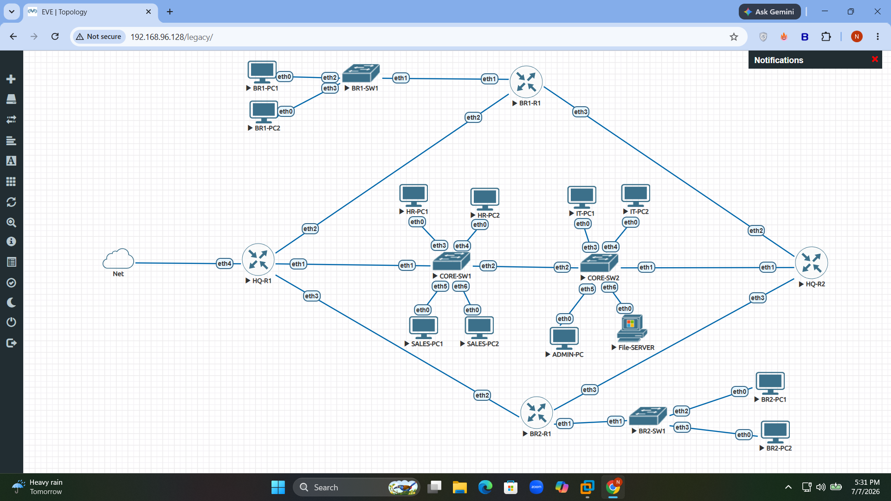

<div align="center">

# 🌐 Production-Grade Enterprise Multi-Branch Network Architecture with High Availability & Multi-Area Dynamic Routing

An advanced, end-to-end enterprise infrastructure framework engineered inside the **EVE-NG** software emulation ecosystem using **MikroTik RouterOS (CHR) v7**. This repository features a comprehensive implementation of actual corporate network operations—spanning Layer 2 broadcast boundary enforcement, hierarchical multi-area dynamic routing architectures, zero-trust stateful firewall security policies, hot-standby gateway clusters, and centralized telemetry tracking facility synchronization.




</div>

---

## 📌 Detailed Project Scenario & Executive Narrative

In a modern high-scale corporate environment, network infrastructure must satisfy three critical engineering metrics: **Zero Downtime (High Availability)**, **Data Confidentiality (Strict Security Zoning)**, and **Scalable Management (Operational Automation)**. 

This project simulates a corporate enterprise consisting of a primary **Corporate Headquarters (HQ) Campus Hub** interconnected across redundant point-to-point leased WAN serial meshes to two remote **Distributed Regional Branch Offices**. Instead of using wide-open, unmonitored default routing, every layer of the infrastructure is built using standard industry best practices on MikroTik RouterOS v7. 

### Why This Architecture Matters:
* **Resilience Against Outages:** The corporate core uses physical gateway pairs grouped into active/standby clusters. If the master interface drops, the backup node takes over the virtual target seamlessly in under 3 seconds.
* **Dynamic Mesh Scaling:** Remote sites run isolated dynamic stubs. Adding a new regional branch office requires zero static routing adjustments at the central hub.
* **Zero-Trust Hardening:** Lateral movement between administrative sections and endpoint spaces is blocked directly at the gateway layer using stateful access rules.

---

## 🏗️ Deep-Dive Structural Architecture Breakdown

The entire enterprise address allocation scheme uses a structured, non-overlapping **RFC 1918 Private Address Blueprint**, dividing the subnets cleanly to simplify administration and path summaries.

```text
                                     [ PUBLIC INTERNET ]
                                              │
                                              ▼
                             [ HQ-R1 Master ] ↔ [ HQ-R2 Standby ] (VRRP Cluster Gateway .254)
                                              │
                      ┌───────────────────────┴───────────────────────┐
                      ▼                                               ▼
         [ CORE-SW1 Distribution ]                       [ CORE-SW2 Datacenter Ingress ]
                      │                                               │
      ┌───────────────┼───────────────┐                               ▼
      ▼               ▼               ▼                  [ VLAN 40: Central Servers ]
   VLAN 10         VLAN 20         VLAN 30               - File-SERVER    (172.16.40.20)
  (HR Dept)      (Sales Dept)    (IT Admin)              - SYSLOG-SERVER  (172.16.40.201)
                                                         - NTP-SERVER     (172.16.40.201)
                      │
                      ├───────────────────────────────────────────────┐
                      ▼ (OSPF Area 0 Backbone Transit)                ▼ (OSPF Area 0 Backbone Transit)
             [ BR1-R1 Edge Router ]                          [ BR2-R1 Edge Router ]
                      │ (OSPF Area 10 Stub)                           │ (OSPF Area 20 Stub)
              [ BR1-SW1 Switch ]                              [ BR2-SW1 Switch ]
                      │                                               │
             ┌────────┴────────┐                                      ▼
             ▼                 ▼                         [ VLAN 210: Branch-2 Users ]
         VLAN 110          VLAN 120                           Subnet: 172.16.210.0/24
      (Branch-1 Users)  (Branch-1 Print)
```

### 🏢 1. Corporate Headquarters Campus Domain
The central hub campus terminates multiple internal organizational subnets using an optimized **Router-on-a-Stick (RoaS)** virtual sub-interface model bound to core switching trunks.
* **VLAN 10 (Human Resources):** `172.16.10.0/24` — Encloses local HR workstations and employee records.
* **VLAN 20 (Sales Operations):** `172.16.20.0/24` — Contains transaction processing client systems.
* **VLAN 30 (IT Administration):** `172.16.30.0/24` — Secure subnet for network administrators and engineering management hosts.
* **VLAN 40 (Server Core Farm):** `172.16.40.0/24` — Highly secured data center segment housing central business assets:
  * *Production File Database:* `172.16.40.20`
  * *Centralized Log Aggregator & NTP Time Authority:* `172.16.40.201`
* **VLAN 50 (Management Out-of-Band):** `172.16.50.0/24` — Reserved exclusively for physical device console links.
* **VLAN 60 (Corporate Printers):** `172.16.60.0/24` — Shared office multi-function output hardware.

### 🏬 2. Distributed Branch Offices Domain
Remote sites handle local traffic using localized switching and independent routing nodes to ensure site survivability.
* **Branch Office 1 (OSPF Area 10 - Stub Boundary Region):**
  * Local Edge Gateway Node: `BR1-R1` | Local Distribution Switch: `BR1-SW1`
  * *VLAN 110 (Branch Users):* `172.16.110.0/24` (Dynamic Pool: `.100` to `.200`)
  * *VLAN 120 (Branch Printers):* `172.16.120.0/24`
* **Branch Office 2 (OSPF Area 20 - Stub Boundary Region):**
  * Local Edge Gateway Node: `BR2-R1` | Local Distribution Switch: `BR2-SW1`
  * *VLAN 210 (Branch Users):* `172.16.210.0/24` (Dynamic Pool: `.100` to `.200`)
  * *VLAN 220 (Branch Printers):* `172.16.220.0/24`

---

## 🔁 End-to-End Enterprise Packet Flow Logic

To verify the cross-site forwarding engine, outbound traffic traces from remote endpoints follow a structured path across Layer 2 and Layer 3 boundaries:

1. **Local Ingress Processing:** A workstation inside Branch-1 (`VLAN 110`) initiates an outbound request. The local switch assigns the appropriate VLAN tag to the untagged frames based on its PVID configuration.
2. **Layer 3 Regional Escalation:** The tagged packet transits the local access trunk up to `BR1-R1`, which strips the 802.1Q header and examines the destination field.
3. **Dynamic OSPF Transit:** Matching the destination to its link-state routing table, `BR1-R1` routes the packet over the point-to-point WAN link (`10.0.1.0/30`) toward the Headquarters backbone area core.
4. **Active VRRP Core Redirection:** The packet reaches the HQ fabric and hits the active virtual gateway IP address (**`172.16.x.254`**). The active Master node (`HQ-R1`) intercepts the packet and processes it through its stateful firewall engine.
5. **Stateful Perimeter Inspection & NAT Translation:** The forwarding rules confirm the packet is legitimate. As it exits toward the Internet cloud via the outside WAN interface (`ether4`), the NAT engine records the session and masques the private source address under the gateway's public IP address.
6. **Symmetric Return Delivery:** Inbound internet reply packets are matched against the router's active session state tables, allowing the gateway to translate the destination headers back to the original requesting host.

---

## 📑 Phase-by-Phase Technical Configuration Manuals Index

The entire infrastructure lifecycle is broken down into structured technical modules inside the **[docs/](./docs/)** folder, complete with production-ready RouterOS v7 scripts, configuration parameters, and command validations:

### ⚙️ Module I: Foundation Infrastructure & Initialization
* **[Phase 00 – Hypervisor server & Environment Preparation](./docs/Phase-00-Environment-Preparation.md)**
  * *Focus:* Nested virtualization settings, EVE-NG server deployment parameters, and RouterOS QEMU image integration templates.
* **[Phase 01 – Enterprise Network Design & IP Address Planning](./docs/Phase-01-Enterprise-Network-Planning.md)**
  * *Focus:* Non-overlapping RFC 1918 allocation grids, subnet design math, and multi-site interface mapping models.
* **[Phase 02 – Virtual Topology Assembly & Interface Cabling](./docs/Phase-02-Infrastructure-Deployment.md)**
  * *Focus:* Port-to-port physical mapping matrix verification, link duplex configuration, and host naming standards.

### ⚙️ Module II: Layer 2 Segmentation & Layer 3 Routing Planes
* **[Phase 03 – IEEE 802.1Q Bridge VLAN Filtering Core Configuration](./docs/Phase-03-Layer-2-Bridge-VLAN.md)**
  * *Focus:* Setting up hardware-accelerated bridge filter switches, configuring PVID settings for access ports, and tagging multi-VLAN trunk links.
* **[Phase 04 – Router-on-a-Stick Layer 3 Inter-VLAN Gateway Termination](./docs/Phase-04-Layer-3-Inter-VLAN-Routing.md)**
  * *Focus:* Provisioning virtual sub-interfaces on top of physical trunks and setting up line-rate inter-department routing.
* **[Phase 05 – Centralized DHCP Server Scopes & Remote Relay Automation](./docs/Phase-05-DHCP-Deployment.md)**
  * *Focus:* Defining allocation pool boundaries, setting up automated DORA bindings, and separating client lease scopes.
* **[Phase 06 – OSPFv2 Hierarchical Multi-Area Protocol Path Engine](./docs/Phase-06-OSPF-Multi-Area-Routing.md)**
  * *Focus:* Configuring RouterOS v7 OSPF instances, routing templates, and establishing neighbor relationships across Areas 0, 10, and 20.

### ⚙️ Module III: Security Hardening & High-Availability Clusters
* **[Phase 07 – Centralized Internet Egress WAN Routing & Source NAT](./docs/Phase-07-NAT-Internet-Connectivity.md)**
  * *Focus:* Managing outside ISP interface uplinks, deploying masquerade translation rules, and injecting dynamic default routes (`0.0.0.0/0`).
* **[Phase 08 – Zero-Trust Stateful Firewall Filter Chains & Department ACLs](./docs/Phase-08-Stateful-Firewall-ACL.md)**
  * *Focus:* Building input/forward filter pipelines, preventing lateral movement between restricted subnets, and optimizing connection tracking.
* **[Phase 09 – Dual-Homed VRRP Redundant Gateway High Availability](./docs/Phase-09-VRRP-High-Availability.md)**
  * *Focus:* Virtualizing corporate default gateway points (`.254`), tuning hello keepalive intervals, and verifying transparent user failovers.
* **[Phase 10 – Cryptographic SSHv2 Control Plane Remote Hardening](./docs/Phase-10-SSH-Standard-Hardening.md)**
  * *Focus:* Disabling unencrypted legacy management protocols (Telnet, HTTP, API), enforcing strong cryptographic ciphers, and creating custom admin profiles.

### ⚙️ Module IV: Telemetry Operations & Final System Validation
* **[Phase 11 – Centralized Event Telemetry Aggregation via Remote Syslog](./docs/Phase-11-Centralized-Syslog.md)**
  * *Focus:* Dynamic logging target aggregation and streaming runtime kernel event messages to data center host `172.16.40.201`.
* **[Phase 12 – Authoritative NTP System Time Synchronization Grid](./docs/Phase-12-NTP-Time-Synchronization.md)**
  * *Focus:* Deploying modern RouterOS v7 unicast NTP client servers to correct clock drift and maintain accurate log timestamps.
* **[Phase 13 – Systematic Production Testing & Final Project Validation](./docs/Phase-13-Project-Validation-Testing-and-Conclusion.md)**
  * *Focus:* Comprehensive cross-site validation sweeps, dynamic convergence audits, and structural readiness reviews.
* **[Master Operations Guide – Comprehensive Network Troubleshooting Manual](./docs/Troubleshooting-Guide.md)**
  * *Focus:* A comprehensive diagnostic reference guide listing common system errors, root-cause analyses, and mitigation scripts.

---

## 📊 Infrastructure Validation Status Summary Matrix

The following operational metrics summarize the active status of each component verified during the Phase 13 end-to-end validation testing window:

| Target Verification Control Item | Mapped Infrastructure Component | Current State | Technical Observations & Diagnostic Performance Results |
| :--- | :--- | :--- | :--- |
| **Layer 2 Segmentation** | Bridge VLAN Filtering | ✅ Operational | Hardware filtering active; isolates broadcast domains across all department ports. |
| **Inter-VLAN Forwarding** | Gateway Sub-Interfaces | ✅ Operational | Sub-interfaces handle cross-department transit traffic smoothly at line rate. |
| **Dynamic Addressing** | Central DHCP Pools | ✅ Operational | Allocates IP parameters instantly; dynamic leases successfully bound. |
| **Dynamic Path Propagation**| OSPF Multi-Area Core | ✅ Operational | Neighbor states remain stable in a `Full` state; path loops eliminated. |
| **Border Egress Translation**| Stateful Source NAT | ✅ Operational | Central internet sharing works seamlessly with hidden internal addresses. |
| **Control Plane Security** | Stateful Firewall Filters | ✅ Operational | Input/forward filters enforce zero-trust zoning; blocks unauthorized probes. |
| **Gateway Cluster Redundancy**| VRRP Redundancy Groups | ✅ Operational | Automated active/standby failovers complete transparently in under 3 seconds. |
| **Management Hardening** | Cryptographic SSHv2 | ✅ Operational | Plaintext management protocols disabled globally; ports secured with strong ciphers. |
| **Telemetry Aggregation** | Remote Syslog Engine | ✅ Operational | Live event logs stream continuously over UDP port 514 to the logging facility. |
| **Time Grid Synchronization**| NTP Client Services | ✅ Operational | Device clocks lock reliably to the central server, eliminating clock drift. |

---

## 🛠️ Demonstrated Core Infrastructure Engineering Skills

Building and managing this enterprise network lifecycle demonstrates key proficiencies across several critical infrastructure engineering tracks:
* **Production-Grade Enterprise Architecture:** Translating real-world corporate availability goals into resilient multi-site routing and switching designs.
* **MikroTik RouterOS v7 Expertise:** Deploying advanced platform-specific templates, routing instances, and stateful bridge filters via command-line interface utilities.
* **High Availability Cluster Design:** Virtualizing layer-3 termination points using stateful protocol engines to shield end users from hardware faults.
* **Stateful Firewall Structural Architecture:** Designing secure, multi-zone forward and input filter chains to stop lateral network threats.
* **Telemetry System Operations:** Centralizing log management backplanes and network timing grids to improve audit visibility and speed up incident tracking.

---

## 👨‍💻 Author Profile & Engineering Portfolio

**Neloy Pramanik Supto**  
*Network Security & Systems Infrastructure Engineer*

* **GitHub Main Portfolio:** [https://github.com/Neloy4321](https://github.com/Neloy4321)
* **Active Infrastructure Project Archive:** [Enterprise-Multi-Branch-Network-with-High-Availability](https://github.com/Neloy4321/Enterprise-Multi-Branch-Network-with-High-Availability)

---

## 📜 Project License Boundary
This enterprise deployment documentation, master architectural file set, and hardware configuration script index are open-source assets published under the terms of the **MIT License**. Review the `LICENSE` text file for complete operational compliance details.
```