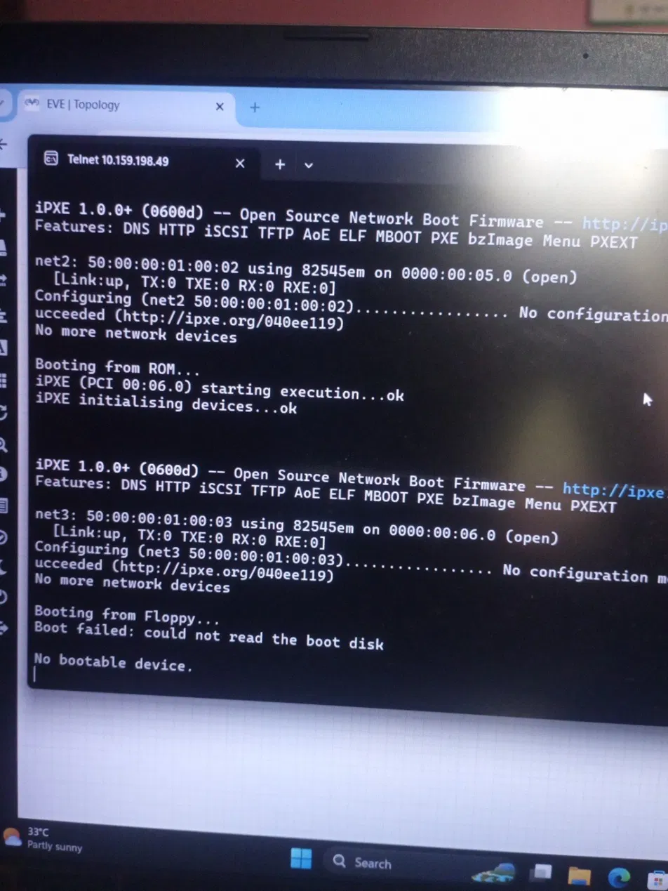
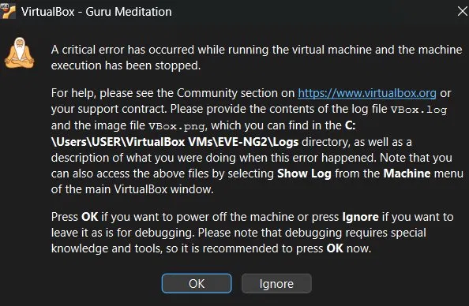
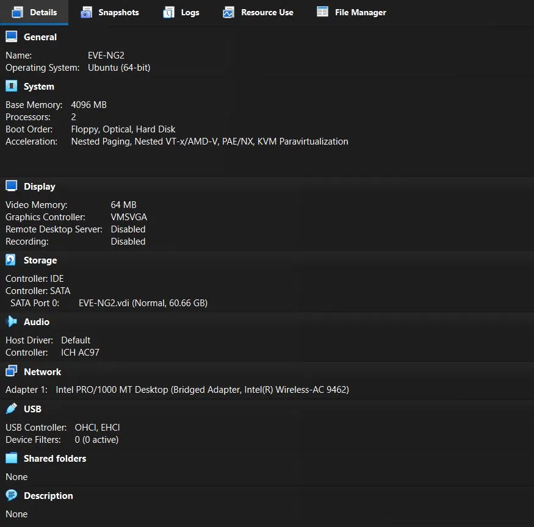
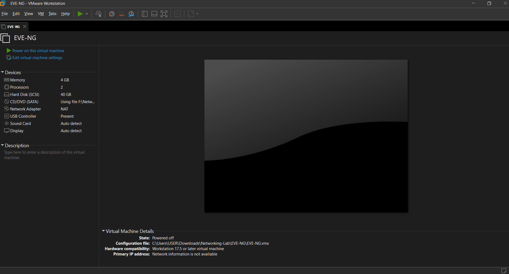
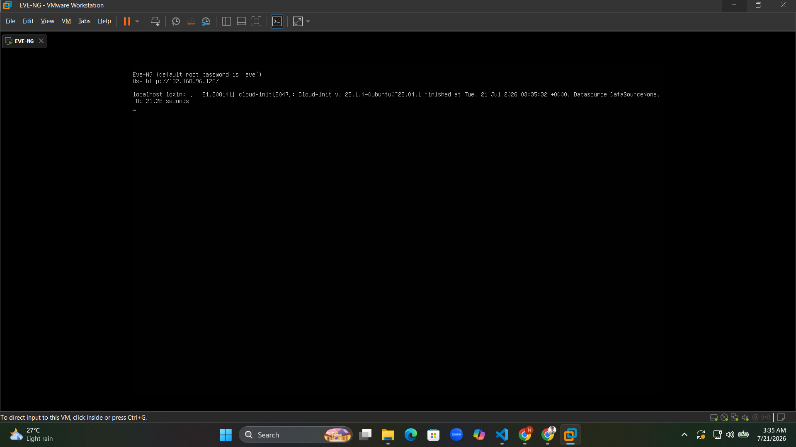
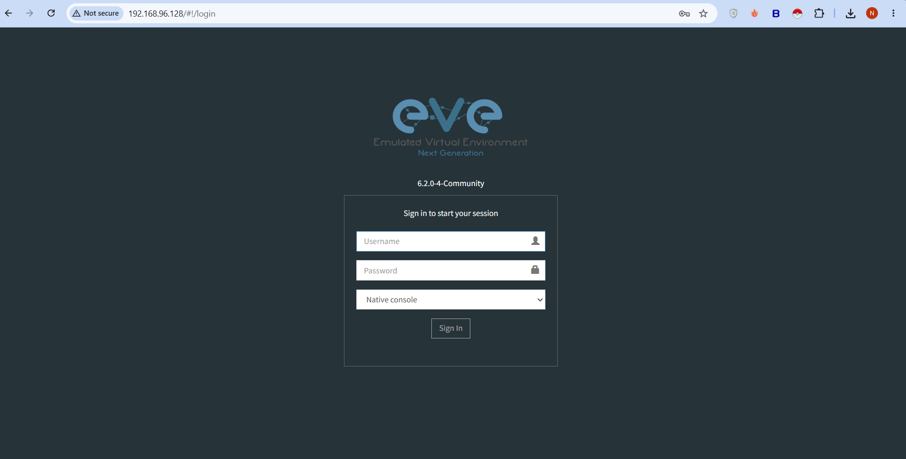
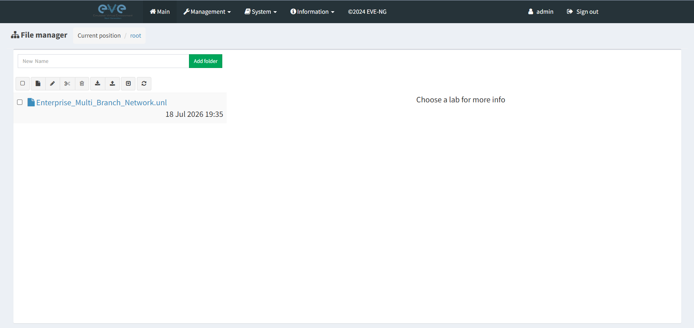
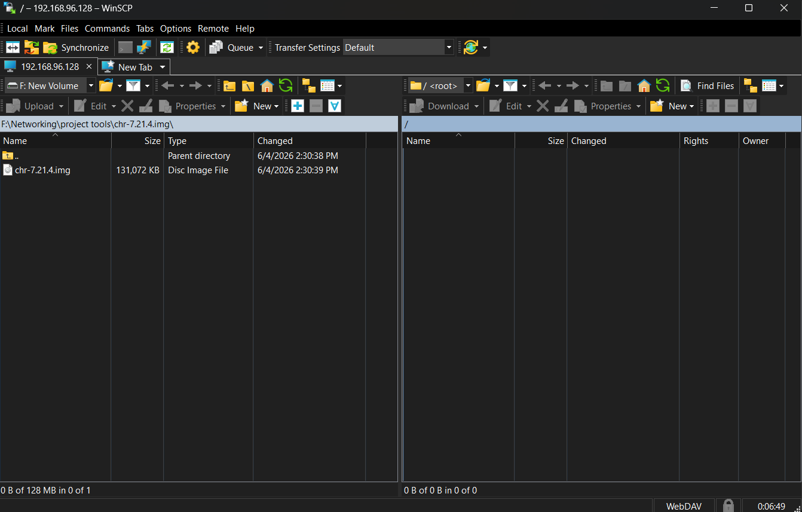
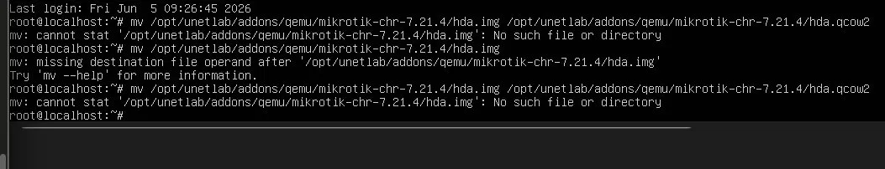
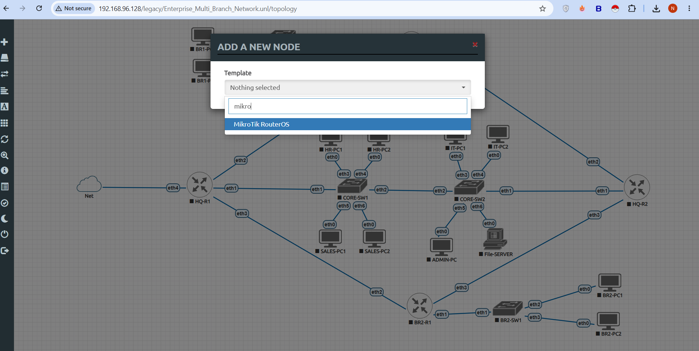

# 🚀 Phase 00 – Environment Setup & Emulation Deployments

## 📌 Objective
The core objective of this phase was to prepare a stable and reliable virtualized lab environment using EVE-NG to simulate an Enterprise Multi-Branch Network with MikroTik CHR Routers[cite: 1]. This stage covers hypervisor deployment optimization, configuration of the network emulation platform, and the successful ingestion of verified MikroTik RouterOS disk images[cite: 1].

---

## 🛠️ Hypervisor Selection & Virtualization Planning

The project deployment was initially attempted using Oracle VM VirtualBox as the primary virtualization platform for running the EVE-NG virtual machine[cite: 1]. However, multiple stability and configuration issues were encountered during testing[cite: 1]:
* The EVE-NG virtual machine failed to boot reliably or maintain stability[cite: 1].
* Network configuration profiles did not function correctly[cite: 1].
* Accessing the lab environment management web interface was highly problematic[cite: 1].
* EVE-NG Community Edition generally delivers more stable performance on VMware platforms[cite: 1].

> **Architectural Decision:** Due to these technical constraints within the VirtualBox execution layer, the decision was made to drop VirtualBox and deploy the platform using VMware Workstation Pro to achieve optimal stability and performance[cite: 1].

### 📑 Documentation Evidence

#### Figure 1. VirtualBox Error Screenshot

*Evidence of the initial setup issues and boot errors inside Oracle VirtualBox[cite: 1].*

---

#### Figure 2. VirtualBox Boot Problem Screenshot

*Documentation tracking the network configuration and access bugs within the VirtualBox deployment attempt[cite: 1].*

---

## 💾 Software Inventory Specifications

The enterprise lab infrastructure was constructed using the following specific software baselines[cite: 1]:

| Structural Component | Selected Platform / Version |
| :--- | :--- |
| **Type-2 Hypervisor** | VMware Workstation Pro (17.x)[cite: 1] |
| **Network Emulator** | EVE-NG Community Edition (6.2.0-4)[cite: 1] |
| **Router Engine Image** | MikroTik CHR (7.21.4)[cite: 1] |

---

## ⚙️ Virtual Machine Resource Allocation

The EVE-NG virtual machine was provisioned within the VMware Workstation hypervisor using the following hardware resource allocations[cite: 1]:
* **vCPU Allocation:** 2 Cores[cite: 1]
* **Memory Profile:** 4096 MB[cite: 1]
* **Virtual Storage Capacity:** 40 GB[cite: 1]
* **Network Adapter Profile:** NAT Mode[cite: 1]
* **Local Storage Target Location:** `C:\Users\USER\Downloads\Networking-Lab\EVE-NG`[cite: 1]

### 📑 Documentation Evidence

#### Figure 3. VMware Hardware Configuration

*Verification of the resource parameters mapped to the virtualization host container[cite: 1].*

---

#### Figure 4. VMware Virtual Machine Creation

*The configuration phase confirming successful allocation and provisioning of the virtual environment[cite: 1].*

---

## 🌐 EVE-NG Server Platform Deployment

Upon completing the hypervisor infrastructure initialization, the EVE-NG installation ISO was mounted, the operating system installation was finalized, and initial configuration parameters were defined[cite: 1].

The instance successfully obtained the following management control plane network profile[cite: 1]:

| Parameter | Metric / Value |
| :--- | :--- |
| **Assigned Management IP** | 192.168.96.128[cite: 1] |
| **Web GUI Interface Endpoint** | `http://192.168.96.128`[cite: 1] |

### 📑 Documentation Evidence

#### Figure 5. EVE-NG Installation Complete Screen

*Terminal console output certifying the successful execution and completion of the core EVE-NG setup[cite: 1].*

---

#### Figure 6. EVE-NG Login Page

*Verification of the responsive HTTP listener on the EVE-NG web interface landing page[cite: 1].*

---

#### Figure 7. EVE-NG Dashboard

*Successful administrative authentication and system entry into the primary operations workspace dashboard[cite: 1].*

---

## 🗂️ MikroTik Cloud Hosted Router (CHR) Ingestion

The MikroTik Cloud Hosted Router (`chr-7.21.4.img`) binary image was uploaded onto the EVE-NG server file system using WinSCP to make the templates selectable inside the lab network[cite: 1]. 

The exact directory paths, renaming structures, and permission rules executed via the secure console terminal consist of the following actions[cite: 1]:

```bash
# 1. Generate the explicit hardware template QEMU target directory framework
mkdir -p /opt/unetlab/addons/qemu/mikrotik-chr-7.21.4

# 2. Transfer the raw binary asset into the folder path and adjust the file name parameters
mv chr-7.21.4.img hda.qcow2

# 3. Apply the global EVE-NG system permission correction utility wrapper
/opt/unetlab/wrappers/unl_wrapper -a fixpermissions
```

Following these execution policies, the RouterOS image template was successfully detected and activated within the device library[cite: 1].

### 📑 Documentation Evidence

#### Figure 8. WinSCP Upload

*Tracking the secure transmission of the chr-7.21.4.img target file into the remote host backend directory[cite: 1].*

---

#### Figure 9. CHR Directory Verification

*Verifying the path structure, directory creation, and file rename adjustments inside the target file system[cite: 1].*

---

#### Figure 10. MikroTik Template Detection

*Active confirmation that the MikroTik RouterOS device type template is successfully parsed and selectable in EVE-NG[cite: 1].*

---

## 🔍 Validation Matrix

| Target Verification Control Item | Current Status | Notes |
| :--- | :--- | :--- |
| VMware Virtual Machine Running | ✅ Verified | Hypervisor hosting layer reports healthy operating status[cite: 1]. |
| EVE-NG Installed Successfully | ✅ Verified | Core system components initialized without runtime errors[cite: 1]. |
| Web Interface Accessible | ✅ Verified | Secure access validated via `http://192.168.96.128`[cite: 1]. |
| MikroTik CHR Imported | ✅ Verified | Image binary correctly placed in the designated path framework[cite: 1]. |
| RouterOS Template Detected | ✅ Verified | Node selection catalogs display the template asset actively[cite: 1]. |
| Lab Ready for Deployment | ✅ Verified | All architectural environment readiness gates successfully passed[cite: 1]. |

---

## 🎯 Phase Outcome
Phase 00 has successfully achieved all environmental infrastructure design requirements[cite: 1]. By shifting from the unstable VirtualBox configuration to a robust VMware Workstation Pro hypervisor arrangement, nested virtualization bottlenecks were resolved[cite: 1]. The EVE-NG platform is fully initialized, system permissions are correctly configured, and the MikroTik CHR v7 image library is successfully integrated into the system core[cite: 1]. The testbed environment is now prepared to transition into the active network design and topology addressing stages[cite: 1].
```