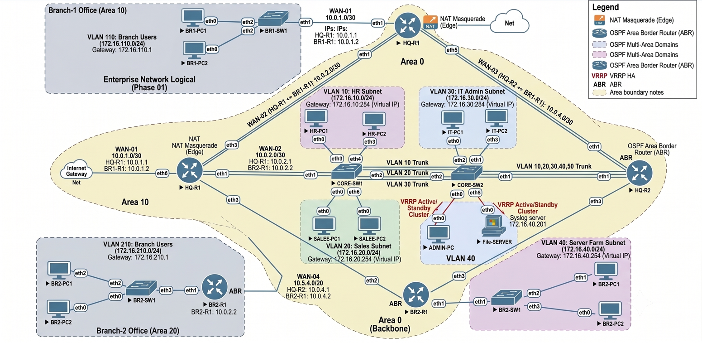
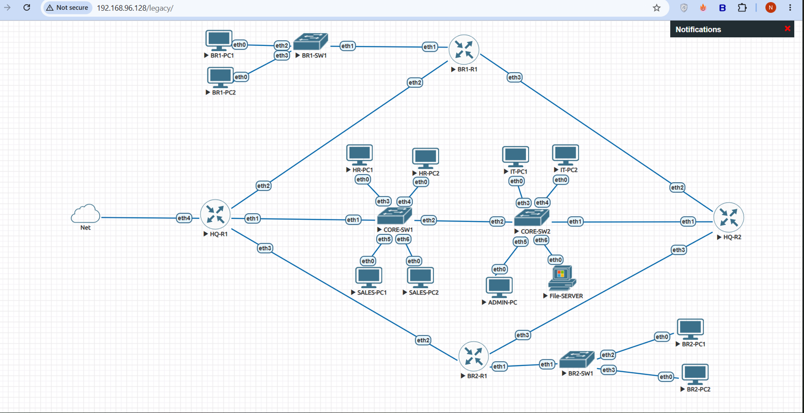

# Phase 01 – Enterprise Network Planning & Design

## Objective

The objective of this phase was to design a scalable, secure, and highly available enterprise network architecture before beginning the actual implementation. A detailed network plan was prepared, including the physical and logical topology, IP addressing scheme, VLAN allocation, interface mapping, and network services to ensure a structured deployment throughout the project.

---

# Project Overview

This project simulates a real-world enterprise network consisting of one Headquarters (HQ) and two branch offices connected through dynamic routing. The network is designed to provide centralized management, secure communication, efficient traffic segmentation, and high availability while remaining scalable for future expansion.

The enterprise network includes:

- Headquarters (HQ)
- Branch Office 1
- Branch Office 2
- Core Switching Infrastructure
- Dynamic Routing
- VLAN Segmentation
- DHCP Services
- NAT
- Firewall & ACL
- VRRP High Availability

---

# Project Requirements

The following requirements were identified before implementation.

| Requirement | Description |
|-------------|-------------|
| Multi-Branch Connectivity | Connect HQ with two branch offices |
| Dynamic Routing | OSPF Area 0 |
| Network Segmentation | VLAN-based departmental separation |
| Automatic IP Assignment | DHCP for client devices |
| Internet Connectivity | NAT using MikroTik |
| Network Security | Firewall Filters and ACL Rules |
| High Availability | VRRP for gateway redundancy |
| Scalability | Support future network expansion |

---

# Enterprise Network Topology

The enterprise network follows a hierarchical architecture consisting of a Headquarters connected to two branch offices.

The Headquarters acts as the central location responsible for routing, network services, and communication with both branches. Each branch contains its own router and access switch for local users while maintaining connectivity with the HQ through dynamic routing.

This design provides centralized management while allowing independent operation of each branch.

### Documentation Evidence

#### Figure 1. Enterprise Network Topology

*Overall enterprise network topology showing Headquarters and Branch Offices.*

---

#### Figure 2. EVE-NG Lab Topology

*Network topology implemented inside the EVE-NG laboratory environment.*

---

# Network Devices

The following virtual devices were used throughout the project.

| Device | Purpose |
|--------|---------|
| HQ Router | Core routing and centralized services |
| Branch Router 1 | Branch Office 1 routing |
| Branch Router 2 | Branch Office 2 routing |
| Core Switch | VLAN distribution and Layer 2 switching |
| Access Switches | End-user connectivity |
| VPCS | Simulated client devices |

---

# Hardware & Software Environment

| Component | Version |
|-----------|---------|
| VMware Workstation Pro | 17.x |
| EVE-NG Community Edition | 6.2.0-4 |
| MikroTik CHR | 7.21.4 |
| WinSCP | Latest |
| PuTTY | Latest |
| Draw.io | Latest |

---

# Physical and Logical Network Design

The physical topology illustrates how routers, switches, and end devices are interconnected inside the virtual lab.

The logical topology represents the communication flow between network segments, routing domains, VLANs, and enterprise services.

Separating the physical and logical design simplifies troubleshooting and future expansion.

### Documentation Evidence

#### Figure 3. Physical Topology

*Physical connectivity between routers, switches, and end devices.*

---

#### Figure 4. Logical Topology

*Logical communication flow across the enterprise network.*

---

# Interface Mapping

A structured interface mapping was prepared before configuration to simplify deployment and troubleshooting.

| Device | Interface | Connected To |
|--------|-----------|--------------|
| HQ Router | Ether1 | Internet |
| HQ Router | Ether2 | Core Switch |
| HQ Router | Ether3 | Branch Router 1 |
| HQ Router | Ether4 | Branch Router 2 |
| Branch Router 1 | Ether2 | Branch Switch |
| Branch Router 2 | Ether2 | Branch Switch |

### Documentation Evidence

#### Figure 5. Interface Mapping

*Interface mapping between all enterprise network devices.*

---

# IP Addressing Strategy

A structured IP addressing plan was developed to ensure proper subnet allocation, minimize address conflicts, and simplify future expansion.

Separate IP ranges were assigned for each VLAN and branch office.

### Documentation Evidence

#### Figure 6. IP Addressing Plan

*Enterprise IP addressing strategy used throughout the project.*

---

# VLAN Planning

Different VLANs were planned to isolate departments and improve network security and traffic management.

The VLAN design allows each department to operate independently while communicating through Inter-VLAN routing.

### Documentation Evidence

#### Figure 7. VLAN Planning

*Planned VLAN structure for the enterprise network.*

---

# Network Services Overview

The following enterprise services were planned before implementation.

| Service | Purpose |
|----------|---------|
| VLAN | Departmental Segmentation |
| Inter-VLAN Routing | Communication between VLANs |
| DHCP | Automatic IP Assignment |
| OSPF | Dynamic Routing |
| NAT | Internet Access |
| Firewall | Traffic Filtering |
| ACL | Access Control |
| VRRP | Gateway Redundancy |

---

# Project Workflow

The project was completed following a structured implementation process to ensure that each networking component was configured, tested, and documented before proceeding to the next phase.

### Documentation Evidence

#### Figure 8. Project Workflow

*Overall implementation workflow followed during the project.*

---

# Phase Verification

The planning phase was verified before starting the implementation.

| Verification Item | Status |
|-------------------|--------|
| Enterprise Requirements Defined | ✅ |
| Network Topology Designed | ✅ |
| Device Selection Completed | ✅ |
| Interface Mapping Prepared | ✅ |
| IP Addressing Planned | ✅ |
| VLAN Structure Designed | ✅ |
| Network Services Planned | ✅ |
| Ready for Implementation | ✅ |

---

# Outcome

This phase successfully established the complete design blueprint for the enterprise network. The topology, device layout, interface mapping, IP addressing strategy, VLAN planning, and required network services were finalized before implementation. With a well-defined design in place, the project was ready to proceed to the configuration and deployment phases. 