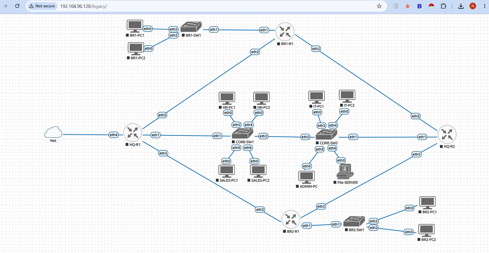
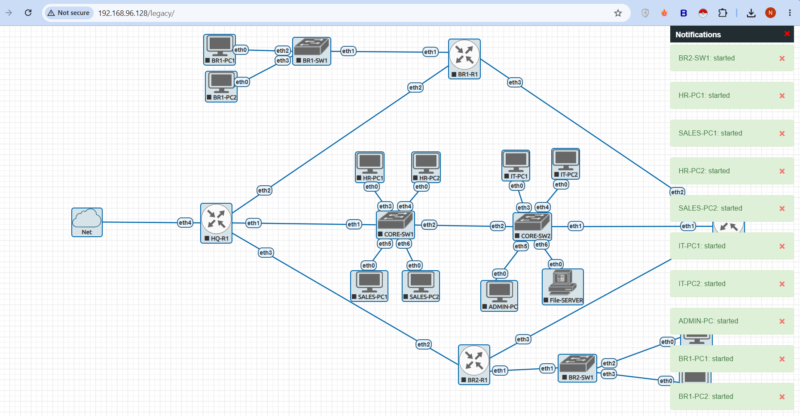
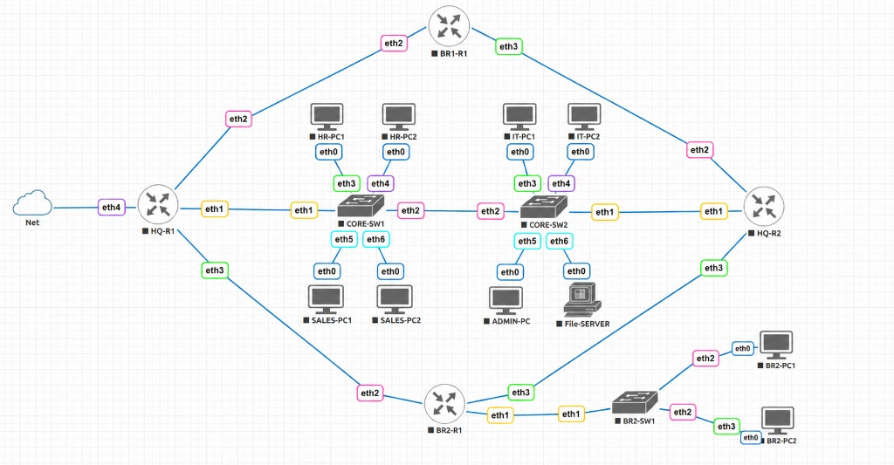
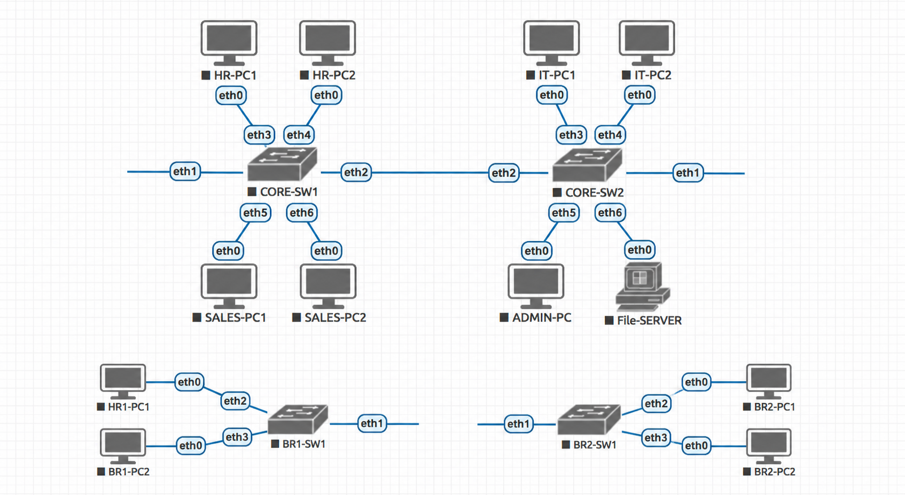
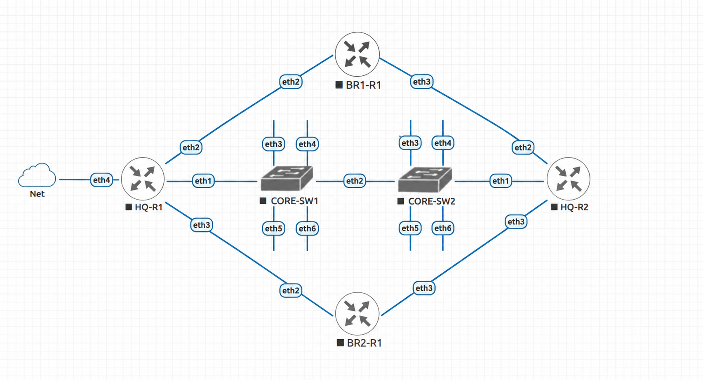
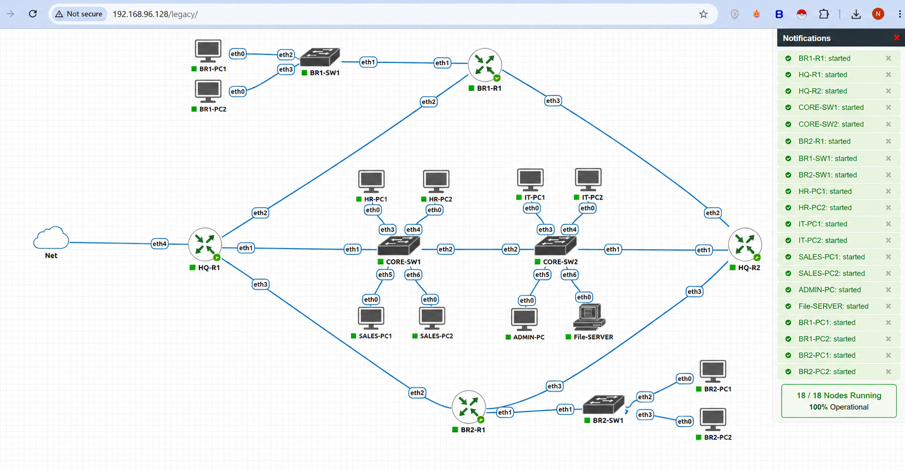

# 🚀 Phase 02 – Infrastructure Deployment & Topology Composition

## 📌 Objective
The primary objective of this phase was to systematically instantiate the raw physical infrastructure layer within the **EVE-NG** emulation platform[cite: 1, 2]. This stage focuses on the structural placement of QEMU routing and switching nodes, provisioning virtual client endpoints, executing precise port-to-port cable interconnections, and running baseline hardware state audits before applying any logical Layer 2 or Layer 3 configurations[cite: 1, 2].

---

## 🏗️ Infrastructure Deployment Matrix

Following the design parameters approved in the planning phase, the enterprise architecture was mapped onto the EVE-NG canvas workspace[cite: 1, 2]. Devices were organized into distinct geographical zones (Corporate Headquarters, Branch-1, and Branch-2) to ensure structural readability and ease long-term troubleshooting[cite: 1].

No networking services, IP assignments, or firewall policies were active during this deployment window; the focus was purely on establishing the underlying hardware matrix[cite: 1].

### 📑 Documentation Evidence

#### Figure 1. Global Enterprise Infrastructure Canvas

*Complete physical layout composition actively provisioned within the EVE-NG sandbox environment[cite: 1, 2].*

---

## 🎛️ Computing & Routing Node Ingestion

The core routing layer comprises four MikroTik Cloud Hosted Router (CHR) virtual instances operating on standard QEMU templates[cite: 1, 2]. These instances provide the raw processing capacity needed for multi-area OSPF routing, stateful packet inspection, and active gateway failovers[cite: 1].

| Node Hostname | Image Template | Resource Profile | Deployment Role & Objective |
| :--- | :--- | :--- | :--- |
| **HQ-R1** | `mikrotik-chr-7.21.4` | 1 vCPU / 256 MB[cite: 2] | Primary HQ Border Gateway / VRRP Master Router / NAT Egress Edge[cite: 1]. |
| **HQ-R2** | `mikrotik-chr-7.21.4` | 1 vCPU / 256 MB[cite: 2] | Redundant HQ Core Gateway / VRRP Backup Router / Dynamic OSPF Anchor[cite: 1]. |
| **BR1-R1** | `mikrotik-chr-7.21.4` | 1 vCPU / 256 MB[cite: 2] | Branch-1 Perimeter Boundary Gateway Node (OSPF Area 10)[cite: 1]. |
| **BR2-R1** | `mikrotik-chr-7.21.4` | 1 vCPU / 256 MB[cite: 2] | Branch-2 Perimeter Boundary Gateway Node (OSPF Area 20)[cite: 1]. |

### 📑 Documentation Evidence

#### Figure 2. Routing Engines Activation

*MikroTik RouterOS v7 instances successfully positioned and tracking clean power states[cite: 1, 2].*

---

## 🎚️ Switching Fabric Deployment

Layer 2 distribution and access structures were established using high-density virtual switches[cite: 1, 2]. These fabrics are sized to handle multi-VLAN trunk configurations and hardware-level bridge filtering[cite: 1, 2].

* **Headquarters Switching Array:** Deployed `CORE-SW1` and `CORE-SW2` in a redundant core configuration to support multi-department cross-chassis trunks[cite: 1, 2].
* **Branch Switching Arrays:** Deployed `BR1-SW1` and `BR2-SW1` to handle access-layer distribution for remote client endpoints[cite: 1, 2].

### 📑 Documentation Evidence

#### Figure 3. Core Switching Matrix Ingestion

*Switching components deployed and aligned for IEEE 802.1Q broadcast domain segmentation[cite: 1, 2].*

---

## 🖥️ Simulated Endhosts & Centralized Application Layers

To thoroughly validate network operations (such as DHCP leases, Inter-VLAN routing, NAT translation, and stateful ACL drops), virtual client endpoints and production servers were integrated directly into their designated segments[cite: 1, 2]:

* **HQ Corporate User Space:** Provisioned specialized Virtual PC Simulators (VPCS) mapping back to the **HR**, **Sales**, **IT**, and **Management** zones[cite: 1, 2].
* **HQ Datacenter Server Farm:** Provisioned the core `File-SERVER` alongside the dedicated `SYSLOG-SERVER` / `NTP-SERVER` asset within the isolated Server segment[cite: 1, 2].
* **Branch Office Endpoint Spaces:** Provisioned localized client VPCS hosts (`BR1-PC1`, `BR1-PC2`, `BR2-PC1`, `BR2-PC2`) across both remote distributed sites[cite: 1, 2].

### 📑 Documentation Evidence

#### Figure 4. Enterprise Client Sub-Arrays

*Simulated user endpoint nodes actively provisioned across all target department networks[cite: 1, 2].*

---

## 🔌 Link Interconnection Matrix

Cabling layouts were executed using an exact port-to-port mapping scheme to prevent packet leaks and interface alignment errors during downstream configuration stages[cite: 1, 2]:

```text
  [ Corporate HQ Backbone ] ──> HQ-R1/HQ-R2 eth1 ↔ CORE-SW1/CORE-SW2 eth1 (Core Trunks)[cite: 2]
                                         │
                                         ▼
  [ Point-to-Point WAN Mesh ] ──> HQ Gateways eth2/eth3 ↔ Branch Routers eth2/eth3 (Transit Pipes)[cite: 2]
                                         │
                                         ▼
  [ Central Internet Access ] ──> HQ-R1 eth4 ↔ EVE-NG pnet0 Management Cloud (External NAT)[cite: 2]
```

### Verified Connection Interface Mappings:
1. **HQ Core Links:** `HQ-R1 eth1 ↔ CORE-SW1 eth1` | `HQ-R2 eth1 ↔ CORE-SW2 eth1`[cite: 2].
2. **Transit Switching Mesh:** `CORE-SW1 eth2 ↔ CORE-SW2 eth2`[cite: 2].
3. **WAN-01 / WAN-03 Trunks:** `BR1-R1 eth2 ↔ HQ-R1 eth2` | `BR1-R1 eth3 ↔ HQ-R2 eth2`[cite: 2].
4. **WAN-02 / WAN-04 Trunks:** `BR2-R1 eth2 ↔ HQ-R1 eth3` | `BR2-R1 eth3 ↔ HQ-R2 eth3`[cite: 2].
5. **Access Boundary Feeds:** `BR1-R1 eth1 ↔ BR1-SW1 eth1` | `BR2-R1 eth1 ↔ BR2-SW1 eth1`[cite: 2].

### 📑 Documentation Evidence

#### Figure 5. Hardware Interconnect Maps

*Interface maps showing verified patch panel link states across all enterprise interfaces[cite: 1, 2].*

---

## 🔍 Post-Deployment Infrastructure Audit

Before finalizing this deployment stage, a strict configuration check was performed to confirm hypervisor stability and topology alignment[cite: 1]:
* Verified all four core routing engines booted cleanly without kernel faults[cite: 1].
* Confirmed that all access layer links reported active statuses with zero interface drops[cite: 2].
* Audited all physical ports against the master design spec to ensure absolute interface symmetry[cite: 1].

### 📑 Documentation Evidence

#### Figure 6. Validated Emulation Topology Engine

*The fully assembled enterprise multi-branch network ready for configuration scripting[cite: 1, 2].*

---

## 🔍 Validation Matrix

| Target Verification Control Item | Current Status | Structural Notes |
| :--- | :--- | :--- |
| **Global Topology Schema Instantiated** | ✅ Validated | Visual node coordinates mapped correctly onto the canvas[cite: 1]. |
| **HQ Redundant Routing Pair Deployed** | ✅ Validated | `HQ-R1` and `HQ-R2` CHR templates running stable metrics[cite: 1, 2]. |
| **Branch Boundary Engines Provisioned** | ✅ Validated | `BR1-R1` and `BR2-R1` boundary systems active[cite: 1, 2]. |
| **Switching Fabric Layers Positioned** | ✅ Validated | Core and access switches provisioned for bridge filtering[cite: 1, 2]. |
| **Endpoint Client Emulators Staged** | ✅ Validated | Department user spaces and datacenter servers running cleanly[cite: 1, 2]. |
| **Physical Cable Interconnections Fixed** | ✅ Validated | All point-to-point WAN and LAN trunk lines verified port-to-port[cite: 1, 2]. |
| **Edge Management Cloud Integrated** | ✅ Validated | `HQ-R1 eth4` mapped successfully to the external `pnet0` network[cite: 2]. |

---

## 🎯 Phase Outcome
Phase 02 has successfully reached its structural objectives[cite: 1]. The raw enterprise multi-branch network environment is now completely assembled and validated inside EVE-NG[cite: 1, 2]. All computing engines, core switches, and client endhosts are properly cabled and showing healthy power states[cite: 1, 2]. The virtual testbed has passed all physical readiness checks and is fully prepared for Phase 03, where we will build the Layer 2 bridge VLAN segmentation structures[cite: 1].
```