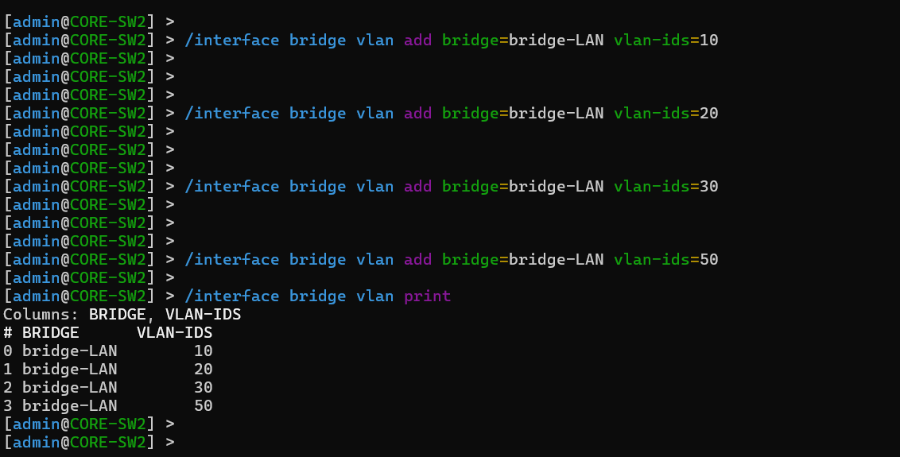
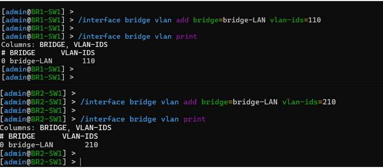
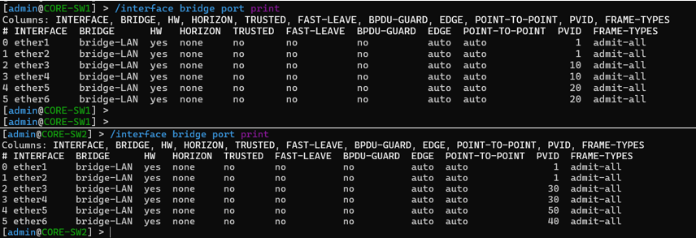
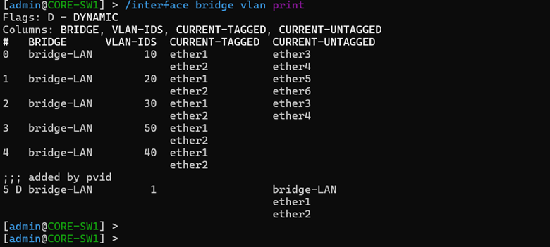
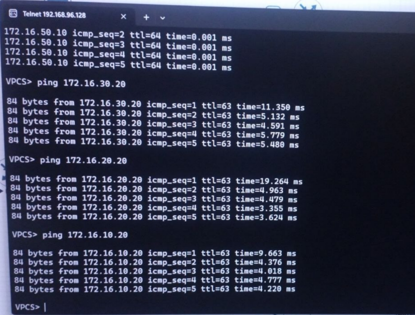

# 🚀 Phase 03 – Layer 2 Bridge VLAN & Trunk Configuration

## 📌 Objective
The primary objective of this phase was to construct an industry-compliant Layer 2 architecture by implementing logical network segmentation using **IEEE 802.1Q Virtual Local Area Networks (VLANs)** across the entire enterprise fabric. This layout isolates corporate broadcast domains, mitigates unnecessary broadcast storms, optimizes traffic paths, and builds a strict trust barrier between functional zones before deploying higher-level routing layers.

---

## 🏗️ Enterprise VLAN Segmentation Matrix

The logical design groups corporate operations into independent, numbered broadcast groups[cite: 1]. By matching the third octet of each network subnet directly to its structural VLAN ID, long-term administration and access control lists are highly streamlined[cite: 1].

### 1. Corporate Headquarters (HQ) Segment Allocations
The central campus switching core handles multiple local organizational segments, separating production, storage, and device management elements[cite: 1].

| VLAN ID | Broadcast Domain Name | Targeted Enterprise Department | Planning Objective & Logical Scope |
| :--- | :--- | :--- | :--- |
| **10** | `HR` | Human Resources | Isolates internal HR client systems and local employee records[cite: 1]. |
| **20** | `SALES` | Sales Operations | Contains general sales transaction client endpoints and general traffic[cite: 1]. |
| **30** | `IT` | IT Administration | Grants authorized secure access to systems administrators and engineering nodes[cite: 1]. |
| **40** | `SERVER` | Central Core Datacenter | Encloses business infrastructure nodes including the File, Syslog, and NTP systems[cite: 1, 2]. |
| **50** | `MANAGEMENT` | Device Management Core | Anchors the physical out-of-band management interfaces for hardware nodes[cite: 1]. |
| **60** | `PRINTER` | Network Printing Assets | Reserved explicitly for shared multi-function network printers[cite: 1]. |

#### 📑 Documentation Evidence
##### Figure 1. Corporate Headquarters Active VLAN Mappings

*Active configuration table showing operational VLAN boundaries inside the core switching core[cite: 1].*

---

### 2. Distributed Branch Architecture Allocations
Remote branches leverage a dedicated numbering strategy, allocating the 100-series range for Branch-1 and the 200-series range for Branch-2 to avoid structural overlap[cite: 1].

#### Branch Office 1 Zone
| VLAN ID | Broadcast Domain Name | Target Function | Subnet Reference Placement |
| :--- | :--- | :--- | :--- |
| **110** | `BR1-USERS` | Local User Endpoints | Encloses local distributed client systems inside Branch-1[cite: 1, 2]. |
| **120** | `BR1-PRINTER` | Local Office Printers | Reserved for local physical output hardware resources[cite: 1]. |

#### Branch Office 2 Zone
| VLAN ID | Broadcast Domain Name | Target Function | Subnet Reference Placement |
| :--- | :--- | :--- | :--- |
| **210** | `BR2-USERS` | Local User Endpoints | Encloses local distributed client systems inside Branch-2[cite: 1, 2]. |
| **220** | `BR2-PRINTER` | Local Office Printers | Reserved for branch multi-function hardware resources[cite: 1]. |

#### 📑 Documentation Evidence
##### Figure 2. Branch Regional VLAN Assignments

*Logical metrics verifying isolation constraints deployed across remote branch edge switching nodes[cite: 1].*

---

## 🛠️ Access Port Ingress Filtering Configuration

To enforce strict edge validation, access switch interfaces are mapped directly to their targeted operational VLAN profiles[cite: 1]. Using RouterOS v7 Bridge VLAN Filtering rules, untagged packets entering ingress ports are stamped with an explicit Port VLAN ID (PVID), safely separating traffic right at the network edge[cite: 1].

### Core Interface Membership Mapping Matrix:
* **CORE-SW1 Department Access Feeds:** `ether3` enforces a hard mapping to PVID 10 (HR)[cite: 1]. `ether4` binds traffic to PVID 20 (Sales)[cite: 1]. `ether5` dynamically tracks PVID 30 (IT Admin)[cite: 1].
* **CORE-SW2 Data Center Access Feeds:** `ether3` maps directly to PVID 40 (Production Servers)[cite: 1]. `ether4` hosts administrative nodes on PVID 50 (Management)[cite: 1]. `ether7` isolates logging endpoints on PVID 40[cite: 1, 2].
* **Remote Distributed Branch Feeds:** `BR1-SW1 ether2/ether3` binds local branch endpoints to PVID 110[cite: 1, 2]. `BR2-SW1 ether2` anchors remote nodes securely on PVID 210[cite: 1, 2].

#### 📑 Documentation Evidence
##### Figure 3. Switch Interface Access Parameters

*Active configuration dashboard confirming successful PVID ingress mappings across local edge ports[cite: 1].*

---

## 🔀 Trunk Link Egress Tagging Implementation

To easily route multiple broadcast groups over a single physical cable, specific trunk links were established between core switches and gateway routers[cite: 1]. These connections append standard 802.1Q headers to egress frames, preserving critical logical boundaries across the network[cite: 1].

### Production Implementation Logic (RouterOS v7 Standard):
1. **Switch-to-Router Uplinks:** `CORE-SW1 ether1` bridges to `HQ-R1`[cite: 1, 2]. `CORE-SW2 ether1` mirrors this uplink to `HQ-R2`[cite: 1, 2]. Both configurations allow tagged egress tracking for the entire corporate profile[cite: 1].
2. **Inter-Switch Fabric Backbone:** `CORE-SW1 ether2 ↔ CORE-SW2 ether2` forms a vital cross-chassis backbone[cite: 1, 2]. This link tags traffic across all enterprise zones, allowing smooth transit between corporate switches[cite: 1].
3. **Branch Boundary Feeds:** `BR1-SW1 ether1` and `BR2-SW1 ether1` tag local traffic up to their respective branch gateway interfaces[cite: 1, 2].

```text
  [ Untagged Frame ] ──> Ingress Access Port (Stamps PVID tag onto packet header)
                                    │
                                    ▼
  [ Tagged 802.1Q Frame ] ──> Transport Trunk Link (Preserves logical zone separation)
                                    │
                                    ▼
  [ Filtered Output ] ──> Egress Bridge Filtering Engine (Drops mismatched tags instantly)
```

#### 📑 Documentation Evidence
##### Figure 4. 802.1Q Trunk Pipeline Verification

*Terminal parameters displaying established 802.1Q trunk lines bridging multi-vlan traffic[cite: 1].*

---

## 🔍 Layer 2 Structural Verification

Once configuration scripts were applied, the local switch bridge databases were audited using `/interface/bridge/vlan/print` to confirm absolute stability[cite: 1]:
* Confirmed that VLAN identification headers accurately matched their intended structural locations[cite: 1].
* Verified that ingress access ports correctly handled PVID tracking, stripping outbound tags seamlessly on egress[cite: 1].
* Audited all inter-switch core lines to confirm they were stably processing 802.1Q tagged headers[cite: 1].
* Activated hardware-level bridge filtering (`vlan-filtering=yes`) across all devices to lock down and protect the Layer 2 boundaries[cite: 1].

#### 📑 Documentation Evidence
##### Figure 5. Bridge VLAN Database Audit

*Live terminal verification showing a clean, error-free Layer 2 database alignment[cite: 1].*

---

## 🔍 Validation Matrix

| Target Verification Control Item | Current Status | Technical Metrics / Observations |
| :--- | :--- | :--- |
| **HQ Segment Matrices Instantiated** | ✅ Validated | Database accurately maps corporate zones 10, 20, 30, 40, and 50[cite: 1]. |
| **Branch Distribution Layers Built** | ✅ Validated | Branch-1 (110) and Branch-2 (210) domains verified active[cite: 1]. |
| **Ingress Access Ports Mapped** | ✅ Validated | Edge ports correctly drop untagged frames into designated PVID zones[cite: 1]. |
| **802.1Q Core Trunk Fabrics Fixed** | ✅ Validated | Inter-switch and router pipelines actively tagging egress headers[cite: 1]. |
| **Bridge VLAN Filtering Activated** | ✅ Validated | Dynamic hardware filtering active; illegal frames dropped at edge[cite: 1]. |
| **Layer 2 Broadcast Domains Isolated** | ✅ Verified | Inter-switch leaks prevented; environment prepped for L3 routing[cite: 1]. |

---

## 🎯 Phase Outcome
Phase 03 has successfully met its structural design criteria[cite: 1]. The raw physical network topology is now neatly partitioned into isolated, hardware-enforced Layer 2 broadcast domains[cite: 1]. Ingress filtering actively controls edge traffic, core trunk links successfully tag data across the fabric, and unmapped packets are immediately blocked[cite: 1]. The corporate environment has passed all Layer 2 stability checks and is fully ready for Phase 04, where we will establish Inter-VLAN Routing using a high-availability Router-on-a-Stick gateway configuration[cite: 1].
```