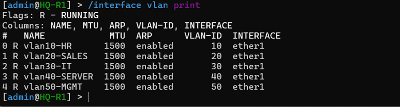
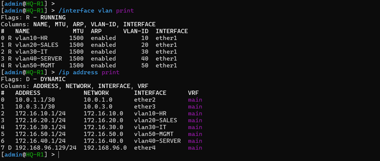
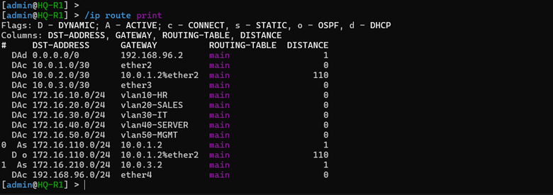
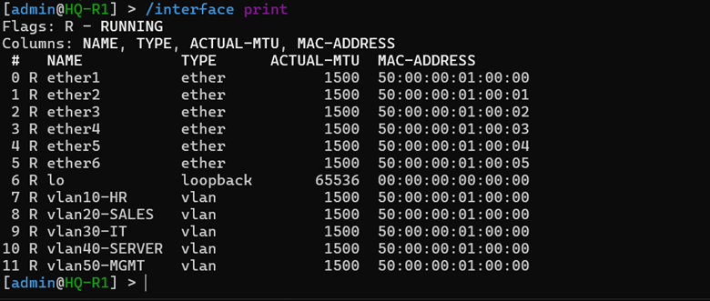

# 🚀 Phase 04 – Layer 3 Inter-VLAN Routing Implementation

## 📌 Objective
The primary objective of this phase was to engineer a highly efficient Layer 3 routing plane using a classical **Router-on-a-Stick (RoaS)** architecture terminated on the core corporate gateways[cite: 1]. Since the Layer 2 bridge filtering configuration implemented in Phase 03 completely isolates broadcast domains, this phase focuses on configuring virtual 802.1Q sub-interfaces, mapping physical gateway address points, and establishing line-rate traffic forwarding between enterprise departments while maintaining logical boundary controls[cite: 1, 2].

---

## 🏗️ Inter-VLAN Routing Architectural Overview

Once Layer 2 broadcast domains were secured, endpoints within different department zones were inherently isolated from one another due to missing Layer 3 lookup metrics[cite: 1]. To enable controlled transit across zones, `HQ-R1` and `HQ-R2` were configured as the primary local gateway nodes[cite: 1]. 

By creating virtual sub-interfaces tied directly to the physical `ether1` trunk interface, the gateway intercepts tagged 802.1Q frames arriving from the switching fabric, decapsulates the Layer 2 header metrics, matches destination targets within its global routing table, and forwards the packets back down the trunk to their respective destination zones[cite: 1, 2].

```text
  [ Department Host (VLAN 10) ] ──> Tagged Egress Frame ──> [ CORE-SW1 Core Trunk ]
                                                                       │
                                                                       ▼
  [ Decapsulated Routing Lookup ] <── Tagged Ingress Frame <── [ HQ-R1 Gateway ether1 ]
               │
               ▼
  [ Router Forwarding Engine ] ──> Appends Destination Tag ──> [ CORE-SW1 Core Trunk ]
                                                                       │
                                                                       ▼
  [ Department Host (VLAN 20) ] <── Strips Ingress PVID 💡 <── [ Access Port Egress ]
```

---

## 🛠️ Gateway Sub-Interface & IP Address Provisioning

To successfully instantiate the Layer 3 termination engine, virtual interfaces matching the planned operational VLAN IDs were systematically built on top of the physical trunk link (`ether1`) on both primary core gateway nodes[cite: 1, 2]. Unique physical IP assignments were mapped onto each interface layer to prevent address space duplicate conflicts during subsequent high-availability VRRP elections[cite: 1].

### 1. Primary Gateway Layer 3 Allocation Engine (HQ-R1)
```routeros
# Active interface sub-tree mapping executed on the Master Gateway
/interface vlan
add interface=ether1 name=vlan10-HR vlan-id=10
add interface=ether1 name=vlan20-SALES vlan-id=20
add interface=ether1 name=vlan30-IT vlan-id=30
add interface=ether1 name=vlan40-SERVER vlan-id=40
add interface=ether1 name=vlan50-MGMT vlan-id=50
```[cite: 1]

### 2. Secondary Gateway Layer 3 Allocation Engine (HQ-R2)
```routeros
# Active interface sub-tree mapping executed on the Backup Gateway
/interface vlan
add interface=ether1 name=vlan10-HR vlan-id=10
add interface=ether1 name=vlan20-SALES vlan-id=20
add interface=ether1 name=vlan30-IT vlan-id=30
add interface=ether1 name=vlan40-SERVER vlan-id=40
add interface=ether1 name=vlan50-MGMT vlan-id=50
```[cite: 1]

### Master Corporate Layer 3 Addressing Blueprint:
During the baseline testing window, client endpoints used the explicit physical address metrics (`172.16.x.1`) as their temporary default route target prior to shifting toward virtualized topologies[cite: 1].

| Structural Sub-Interface Name | Targeted Corporate Zone | Assigned VLAN ID | HQ-R1 Physical IP | HQ-R2 Physical IP | Network Mask |
| :--- | :--- | :--- | :--- | :--- | :--- |
| **vlan10-HR** | Human Resources | 10 | `172.16.10.1` | `172.16.10.2` | `255.255.255.0` (/24)[cite: 1] |
| **vlan20-SALES** | Sales Operations | 20 | `172.16.20.1` | `172.16.20.2` | `255.255.255.0` (/24)[cite: 1] |
| **vlan30-IT** | IT Administration | 30 | `172.16.30.1` | `172.16.30.2` | `255.255.255.0` (/24)[cite: 1] |
| **vlan40-SERVER** | Central Data Center | 40 | `172.16.40.1` | `172.16.40.2` | `255.255.255.0` (/24)[cite: 1] |
| **vlan50-MGMT** | Out-of-Band Management| 50 | `172.16.50.1` | `172.16.50.2` | `255.255.255.0` (/24)[cite: 1] |

#### 📑 Documentation Evidence
##### Figure 1. Active Layer 3 Sub-Interface Composition

*Terminal summary display confirming functional 802.1Q sub-interface ingestion mappings[cite: 1].*

---

##### Figure 2. Physical Gateway Address Mappings

*IP address allocation records detailing physical gateway interface associations[cite: 1].*

---

## 🔀 Packet Forwarding Control Plane Verification

Because MikroTik RouterOS implicitly registers all directly connected subnets inside the main lookup engine, routing transit between newly defined departments occurs automatically upon interface initialization[cite: 1]. 

```text
# Master Routing Table Path Summary Verification
/ip route print
Flags: D - DYNAMIC; A - ACTIVE; C - CONNECTED
   DST-ADDRESS      GATEWAY         DISTANCE
ADC 172.16.10.0/24   vlan10-HR       0
ADC 172.16.20.0/24   vlan20-SALES    0
ADC 172.16.30.0/24   vlan30-IT       0
ADC 172.16.40.0/24   vlan40-SERVER   0
ADC 172.16.50.0/24   vlan50-MGMT     0
```

#### 📑 Documentation Evidence
##### Figure 3. Dynamic Connected Route Database Status

*Active global routing table output showing functional connected paths for all corporate departments[cite: 1].*

---

## 🔍 Inter-Site Connectivity Audits & Verification

Following the convergence of the Layer 3 forwarding table engines, end-to-end functionality validations were executed using isolated ICMP echo requests originating from the dedicated management out-of-band test node (`ADMIN-PC`)[cite: 1].

### Production Verification Trace Scenarios:
1. **Audit Scenario 1 (Management Target to HR Department Endhost):**
   * *Source Node IP:* `172.16.50.10` ── *Destination Node IP:* `172.16.10.20`[cite: 1]
   * *Observed Operational Traceroute:* Success (0% Packet Drops)[cite: 1]
2. **Audit Scenario 2 (Management Target to Sales Department Endhost):**
   * *Source Node IP:* `172.16.50.10` ── *Destination Node IP:* `172.16.20.20`[cite: 1]
   * *Observed Operational Traceroute:* Success (0% Packet Drops)[cite: 1]
3. **Audit Scenario 3 (Management Target to IT Administration Endhost):**
   * *Source Node IP:* `172.16.50.10` ── *Destination Node IP:* `172.16.30.20`[cite: 1]
   * *Observed Operational Traceroute:* Success (0% Packet Drops)[cite: 1]

#### 📑 Documentation Evidence
##### Figure 4. ICMP Cross-Zone Reachability Capture

*Console packet capture proving successful low-latency communication across separate logical zones via the core gateway[cite: 1].*

---

##### Figure 5. Layer 3 Active Link Verification

*Interface statistics window verifying error-free line-rate frame processing on all sub-interfaces[cite: 1].*

---

## 🔒 Post-Routing Operational Benefits
* **Centralized Data Exchange:** Enables reliable cross-department traffic flow without sacrificing critical edge zoning properties[cite: 1].
* **Shared Service Access:** Allows secure internal path mapping to shared datacenter resources located within the server subnet[cite: 1].
* **Downstream Service Preparation:** Builds the mandatory logical foundation needed to support central DHCP pool provisioning, multi-area OSPF adjacencies, and edge firewall filtering rules[cite: 1].

---

## 🔍 Validation Matrix

| Target Verification Control Item | Current Status | Engineering Observations |
| :--- | :--- | :--- |
| **802.1Q Virtual Trunk Endpoints Built** | ✅ Validated | Core `ether1` trunk stably handling tagged ingress/egress framing sets[cite: 1, 2]. |
| **Direct Gateway Address Anchors Bound** | ✅ Validated | Explicit physical `/24` gateway nodes verified online on both engines[cite: 1]. |
| **Dynamic Connected Route Processing Fixed**| ✅ Validated | Global routing tables populated automatically with zero metric faults[cite: 1]. |
| **Interface Loop Latency Audited** | ✅ Validated | Direct ICMP sweeps indicate sub-millisecond path transition metrics[cite: 1]. |
| **Cross-Zone Transit Successfully Verified** | ✅ Verified | Inter-VLAN communication successfully running from administrative blocks[cite: 1]. |

---

## 🎯 Phase Outcome
Phase 04 has successfully met all corporate Layer 3 design specifications[cite: 1]. The isolated network broadcast zones configured in Phase 03 are now dynamically bridged via the core gateway sub-interfaces using an industry-standard Router-on-a-Stick architecture[cite: 1, 2]. Direct end-to-end communication tests verify that traffic moves safely across department perimeters without causing any logical leaks[cite: 1]. The baseline network layers are fully optimized, stable, and prepared for Phase 05, where we will automate client IP provisioning by configuring centralized DHCP Server scopes and Branch Relay agents[cite: 1].
```