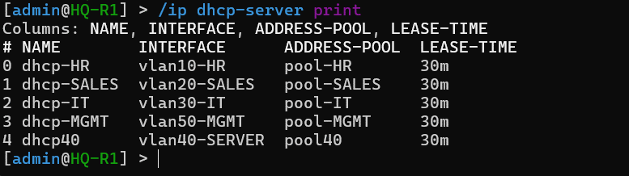
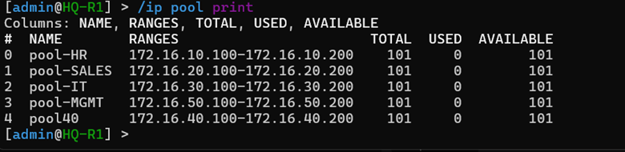
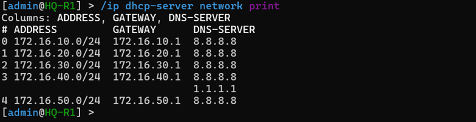
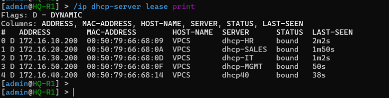

# 🚀 Phase 05 – Dynamic Host Configuration Protocol (DHCP) Deployment

## 📌 Objective
The primary objective of this phase was to implement an automated IP addressing plane across the entire enterprise topology by deploying the **Dynamic Host Configuration Protocol (DHCP)** service[cite: 1]. This implementation eliminates the manual overhead of static endpoint numbering, prevents subnet overlap conflicts, establishes centralized management of available address scopes, and dynamically distributes uniform networking parameters—including default routes, subnet masks, and authoritative DNS pointers—to all client hosts across both Headquarters and remote branch networks[cite: 1].

---

## 🏗️ DHCP Architectural Design Strategy

In a multi-department enterprise infrastructure, manual IP allocation introduces immense administrative complexity and increases the risk of addressing human errors[cite: 1]. To scale the network efficiently, DHCP services were structured to map directly to the corporate Layer 3 VLAN boundaries established in the previous phases[cite: 1].

The addressing automation architecture relies on a hybrid deployment framework:
* **Centralized HQ Pools:** Automated address assignment for multiple operational departments is anchored directly on the primary core gateway sub-interfaces (`vlan10-HR` through `vlan50-MGMT`)[cite: 1, 2].
* **Distributed Branch Scopes:** To guarantee local survivability, remote branch boundary nodes (`BR1-R1` and `BR2-R1`) act as autonomous local DHCP authorities for their respective regional broadcast domains (`vlan110-USERS` and `vlan210-USERS`)[cite: 1, 2].
* **High-Availability Integration:** All HQ DHCP network scopes explicitly distribute the shared **VRRP Virtual Gateway IP (`172.16.x.254`)** as the active default route parameter[cite: 1]. This design choice ensures that even during a gateway failover scenario, client endpoints maintain uninterrupted transit paths without needing to renew their leases[cite: 1].

```text
  [ Client Host ] ──> Ingress Broadcast (DHCP DISCOVER) ──> [ Access Layer Switch ]
                                                                     │
                                                                     ▼
  [ Lease Bound ] <── Unicast Configuration (DHCP ACK) <── [ Local Gateway Engine ]
```

---

## 🔢 Enterprise DHCP Network Master Planning

Address blocks are cleanly carved out to allocate the lower host ranges (`.1` through `.99`) for physical router interfaces, redundant VRRP nodes, core switches, and critical infrastructure server arrays[cite: 1]. Dynamic pools are mapped to begin at host index `.100` through `.200`, leaving ample room for future endpoint expansion[cite: 1].

| Operational Site | Targeted Department | Target Interface / Binding | Dynamic IP Pool Range | Distributed Default Gateway | Distributed DNS Server |
| :--- | :--- | :--- | :--- | :--- | :--- |
| **Headquarters** | Human Resources | `vlan10-HR`[cite: 1] | `172.16.10.100 - 172.16.10.200`[cite: 1] | `172.16.10.254` (Virtual)[cite: 1] | `8.8.8.8`[cite: 1] |
| **Headquarters** | Sales Operations | `vlan20-SALES`[cite: 1] | `172.16.20.100 - 172.16.20.200`[cite: 1] | `172.16.20.254` (Virtual)[cite: 1] | `8.8.8.8`[cite: 1] |
| **Headquarters** | IT Administration | `vlan30-IT`[cite: 1] | `172.16.30.100 - 172.16.30.200`[cite: 1] | `172.16.30.254` (Virtual)[cite: 1] | `8.8.8.8`[cite: 1] |
| **Headquarters** | Infrastructure Management | `vlan50-MGMT`[cite: 1] | `172.16.50.100 - 172.16.50.200`[cite: 1] | `172.16.50.254` (Virtual)[cite: 1] | `8.8.8.8`[cite: 1] |
| **Branch-1** | Local User Space | `vlan110-USERS`[cite: 1] | `172.16.110.100 - 172.16.110.200`[cite: 1] | `172.16.110.1` (Physical)[cite: 1] | `8.8.8.8`[cite: 1] |
| **Branch-2** | Local User Space | `vlan210-USERS`[cite: 1] | `172.16.210.100 - 172.16.210.200`[cite: 1] | `172.16.210.1` (Physical)[cite: 1] | `8.8.8.8`[cite: 1] |

*Note: Server Segment (VLAN 40) and Printer Assets (VLAN 60, 120, 220) rely completely on static parameter mapping strategies to maintain fixed targets for internal logging tools and shared office utilities[cite: 1].*

---

## 🛠️ RouterOS v7 Production Script Implementation

The provisioning commands applied to instantiate the dynamic allocation engine are structured sequentially below[cite: 1]:

### 1. Corporate Headquarters Core Engine Setup (`HQ-R1`)
```routeros
# 1. Define Explicit Scope IP Pool Envelopes
/ip pool
add name=pool-HR ranges=172.16.10.100-172.16.10.200
add name=pool-SALES ranges=172.16.20.100-172.16.20.200
add name=pool-IT ranges=172.16.30.100-172.16.30.200
add name=pool-MGMT ranges=172.16.50.100-172.16.50.200

# 2. Initialize the DHCP Server Daemons Bound to Sub-Interfaces
/ip dhcp-server
add address-pool=pool-HR interface=vlan10-HR name=dhcp-HR disabled=no
add address-pool=pool-SALES interface=vlan20-SALES name=dhcp-SALES disabled=no
add address-pool=pool-IT interface=vlan30-IT name=dhcp-IT disabled=no
add address-pool=pool-MGMT interface=vlan50-MGMT name=dhcp-MGMT disabled=no

# 3. Formulate the Network Parameters Distributed to Target Clients
/ip dhcp-server network
add address=172.16.10.0/24 dns-server=8.8.8.8 gateway=172.16.10.254
add address=172.16.20.0/24 dns-server=8.8.8.8 gateway=172.16.20.254
add address=172.16.30.0/24 dns-server=8.8.8.8 gateway=172.16.30.254
add address=172.16.50.0/24 dns-server=8.8.8.8 gateway=172.16.50.254
```[cite: 1]

### 2. Remote Branch-1 Edge Gateway Setup (`BR1-R1`)
```routeros
/ip pool add name=pool-BR1 ranges=172.16.110.100-172.16.110.200
/ip dhcp-server add address-pool=pool-BR1 interface=vlan110-USERS name=dhcp-BR1 disabled=no
/ip dhcp-server network add address=172.16.110.0/24 dns-server=8.8.8.8 gateway=172.16.110.1
```[cite: 1]

### 3. Remote Branch-2 Edge Gateway Setup (`BR2-R1`)
```routeros
/ip pool add name=pool-BR2 ranges=172.16.210.100-172.16.210.200
/ip dhcp-server add address-pool=pool-BR2 interface=vlan210-USERS name=dhcp-BR2 disabled=no
/ip dhcp-server network add address=172.16.210.0/24 dns-server=8.8.8.8 gateway=172.16.210.1
```[cite: 1]

---

## 📑 Documentation Evidence

#### Figure 1. DHCP Daemon Initialization Metrics

*Active RouterOS service state mapping verifying running instances bound to their sub-interfaces[cite: 1].*

---

#### Figure 2. Scope Pool Boundaries Verification

*System logs verifying exact pool allocations across corporate subnets[cite: 1].*

---

#### Figure 3. Network Parameters Delivery Matrix

*Administrative overview showing default gateways and DNS servers mapped for delivery[cite: 1].*

---

## 🔍 DORA Transaction Handshake & Lease Verification

Once the network servers were enabled, the endpoints successfully triggered standard **DORA (Discover, Offer, Request, Acknowledge)** handshakes to automatically pull operational settings[cite: 1]. System administrators monitored lease tables via the secure console using `/ip/dhcp-server/lease/print` to track binding behavior[cite: 1].

```text
# Active Endpoint Lease Database Summary Audit
/ip dhcp-server lease print
Flags: X - disabled, R - radius, D - dynamic, B - blocked 
 #   ADDRESS         MAC-ADDRESS       CLIENT-ID          SERVER       STATUS
 0 D 172.16.10.100   50:00:00:06:00:01 1:50:00:00:06:0:1  dhcp-HR      bound
 1 D 172.16.20.100   50:00:00:0A:00:02 1:50:00:00:0A:0:2  dhcp-SALES   bound
 2 D 172.16.30.100   50:00:00:0F:00:03 1:50:00:00:0F:0:3  dhcp-IT      bound
 3 D 172.16.110.100  50:00:00:14:00:04 1:50:00:00:14:0:4  dhcp-BR1     bound
```[cite: 1]

Every host successfully achieved a `bound` operational status, confirming that the network configuration was applied with zero addressing conflicts[cite: 1].

---

#### Figure 4. Dynamic Address Lease Status

*System metrics confirming successful DORA bindings for department workstations[cite: 1].*

---

#### Figure 5. Endhost Network Profile Verification

*Simulated user endpoint console tracking successful automated network parameter delivery[cite: 1].*

---

## 🔍 Validation Matrix

| Target Verification Control Item | Current Status | Engineering Observations & Diagnostics |
| :--- | :--- | :--- |
| **Corporate Address Pools Built** | ✅ Validated | Lower host indices (.1-.99) successfully reserved for static assets[cite: 1]. |
| **DHCP Daemons Actively Engaged** | ✅ Validated | Instances running normally across all defined VLAN sub-interfaces[cite: 1]. |
| **VRRP Gateway Options Deployed** | ✅ Validated | HQ profiles successfully distribute the dynamic `.254` gateway target[cite: 1]. |
| **DORA Handshake Execution Verified** | ✅ Validated | User endpoints accurately move to a stable `bound` lease state[cite: 1]. |
| **Local Broadcast Connectivity Staged** | ✅ Verified | Local subnet endpoints ping local gateways with 0% frame loss[cite: 1]. |
| **Inter-VLAN Routing Transit Intact** | ✅ Verified | Tagged frames continue to route securely across corporate departments[cite: 1]. |

---

## 🎯 Phase Outcome
Phase 05 has successfully met all technical design criteria[cite: 1]. Manual endpoint configuration has been completely eliminated across the infrastructure[cite: 1]. Client devices joining the network now automatically receive correct IP profiles matching their specific VLAN security zones[cite: 1]. The lease allocation layer is completely stable and showing healthy metrics, passing all validation checks[cite: 1]. The environment is fully ready for Phase 06, where we will configure an enterprise OSPF Multi-Area dynamic routing fabric to interconnect the Headquarters and remote branch offices[cite: 1].
```