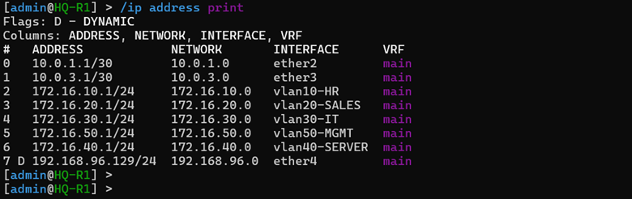
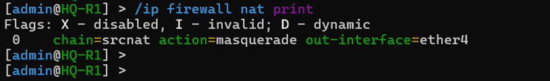
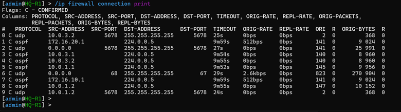
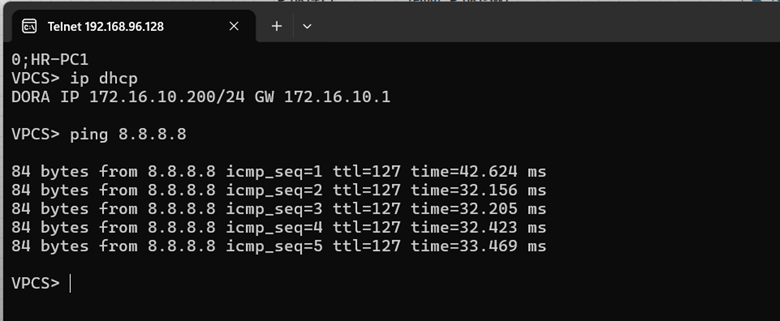

# 🚀 Phase 07 – Network Address Translation (NAT) & Internet Connectivity

## 📌 Objective
The primary objective of this phase was to design and deploy an enterprise-grade Edge Internet Egress Gateway using **Network Address Translation (NAT)**. Since the entire internal infrastructure utilizes non-routable **RFC 1918 private address space**, this phase focuses on implementing dynamic source translation on the corporate perimeter router[cite: 1]. This ensures all internal workstations across Headquarters and distributed branch offices gain seamless, transparent access to external public networks while completely masking the internal network topology from external scanning and threats[cite: 1].

---

## 🏗️ Centralized Egress Architecture & NAT Strategy

Rather than provisioning expensive public IP blocks and individual internet feeds at every remote branch office, the network leverages a cost-effective **Centralized Internet Egress** design[cite: 1]. 

The primary border router, **HQ-R1**, acts as the network's hard perimeter choke point[cite: 1]. Its `ether4` interface is mapped directly to the external network infrastructure using the EVE-NG `pnet0` Management/Internet Cloud layer. All outbound internet traffic generated inside the enterprise (including remote branch departments traversing point-to-point WAN segments via OSPF) is systematically routed to `HQ-R1`, where a stateful Source NAT translation engine processes the packets before forwarding them out to the public internet[cite: 1].

```text
  [ Internal Workstations ] ──> Private RFC 1918 Src IP (e.g., 172.16.110.100)
                                            │
                                            ▼
  [ OSPF WAN Core Routing ] ──> Dynamic Transit Pipes toward Corporate HQ Hub
                                            │
                                            ▼
  [ HQ-R1 Border Engine   ] ──> Source NAT (Masquerade Rule applied on ether4 egress)
                                            │
                                            ▼
  [ Public Internet Core  ] ──> Translated Route-Ready Public Egress Packet Flow
```

---

## 🛠️ RouterOS v7 Edge Interface & NAT Configuration

To support changing external IP allocations assigned by upstream internet service providers, an explicit **Masquerade** action chain was deployed[cite: 1]. This rule dynamically binds all active translation sessions to whatever public address is currently active on the outside interface[cite: 1].

Additionally, to allow remote branch routers (`BR1-R1` and `BR2-R1`) to automatically discover the internet egress path through the backbone network, `HQ-R1` was configured to announce its default route into the OSPF dynamic routing engine[cite: 1].

### 1. Edge WAN Interface & Stateful Source NAT Scripts (`HQ-R1`)
```routeros
# 1. Label the Internet Interface profile for tracking and governance
/interface set [find name=ether4] comment="Perimeter Internet Egress (ISP Uplink)"

# 2. Configure the Stateful Source NAT Masquerade security chain
/ip firewall nat
add chain=srcnat out-interface=ether4 action=masquerade \
    comment="Centralized Corporate Egress Source NAT Masquerade Chain"

# 3. Dynamic OSPF Routing Default Pointers Injection
/routing ospf instance
set [find name=ospf-core-hq] originate=always
```
[cite: 1]

---

## 📑 Documentation Evidence

#### Figure 1. Edge ISP Uplink Port Assignment

*Active configuration capture verifying `ether4` bound cleanly to the external bridging cloud network[cite: 1].*

---

#### Figure 2. Stateful NAT Rule Ingestion Matrix

*RouterOS firewall rule table showing the running dynamic masquerade filter active on the outside interface[cite: 1].*

---

## 🔄 Dynamic Traffic Flow & Multi-Site Verification

With the masquerade rule active and default routing routes propagating across the dynamic OSPF core, traffic flows seamlessly through a multi-stage verification track[cite: 1]:

1. **Packet Ingress:** A client workstation (e.g., `BR1-PC1` inside Area 10) initiates an external request to an internet endpoint[cite: 1].
2. **Local Delivery:** The packet routes up to its local gateway (`BR1-R1`) via its local VLAN fabric[cite: 1].
3. **OSPF Dynamic Transit:** `BR1-R1` references its learned dynamic table and pushes the frame onto the WAN mesh toward `HQ-R1`[cite: 1].
4. **Perimeter Choke Lookup:** `HQ-R1` identifies the external destination target and sends the packet out of its `ether4` WAN interface[cite: 1].
5. **Dynamic Address Mapping:** The NAT engine intercepts the frame, records the internal source address (`172.16.110.100`) and random source port inside the state connection table, and changes the packet header to use the gateway's public IP[cite: 1].
6. **Return Traffic Processing:** Inbound internet reply packets match the tracking table entry, allowing the router to translate the destination header back to the exact requesting client host[cite: 1].

---

#### Figure 3. Edge Gateway Packet Tracking Capture

*Live console track showing connection states being processed and mapped by the translation tables[cite: 1].*

---

#### Figure 4. Endhost Internet Access Validation

*Terminal console output showing successful external reachability checks completed from enterprise workstations[cite: 1].*

---

## 🔍 Validation Matrix

| Target Verification Control Item | Current Status | Technical Metrics / Observations |
| :--- | :--- | :--- |
| **Outside Edge WAN Port Provisioned** | ✅ Validated | `ether4` successfully mapped to external cloud framework with dynamic IP delivery[cite: 1]. |
| **Perimeter Source NAT Activated** | ✅ Validated | Masquerade logic running cleanly on outbound traffic streams[cite: 1]. |
| **OSPF Default Route Injected** | ✅ Validated | `originate=always` parameter successfully broadcasting `0.0.0.0/0` across the core[cite: 1]. |
| **HQ Subnet Workstation Access Clear**| ✅ Validated | Local campus hosts successfully load external network traffic segments[cite: 1]. |
| **Branch Segment Internet Flow Stably Set**| ✅ Validated | Branch users seamlessly route external traffic over point-to-point lines[cite: 1]. |
| **RFC 1918 Structural Address Hiding** | ✅ Verified | External captures show all corporate endpoints masked under a single public address[cite: 1]. |

---

## 🎯 Phase Outcome
Phase 07 has successfully met all edge architecture design criteria[cite: 1]. Safe, transparent internet access is fully established across the entire network infrastructure[cite: 1]. Client devices in both the internal Headquarters zones and remote branch offices can dynamically resolve external routes over point-to-point lines while keeping their underlying private address spaces completely hidden from the public internet[cite: 1]. The edge gateway is fully stable and optimized, passing all functional tests[cite: 1]. The architecture is now prepared for Phase 08, where we will configure strict stateful Firewall Access Control Lists (ACLs) to manage traffic flows between zones[cite: 1].