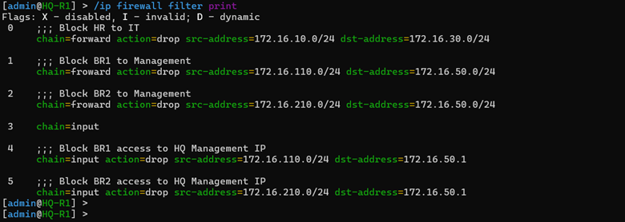
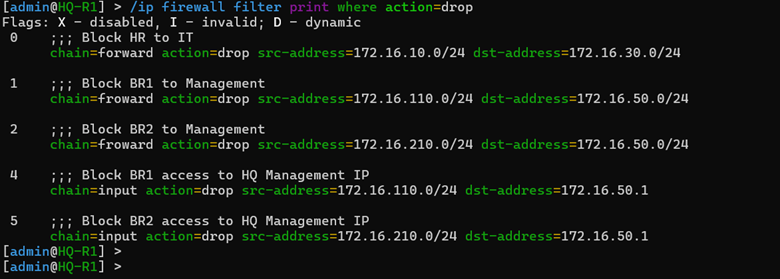
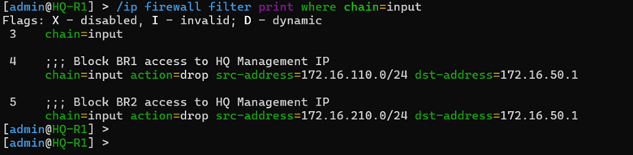
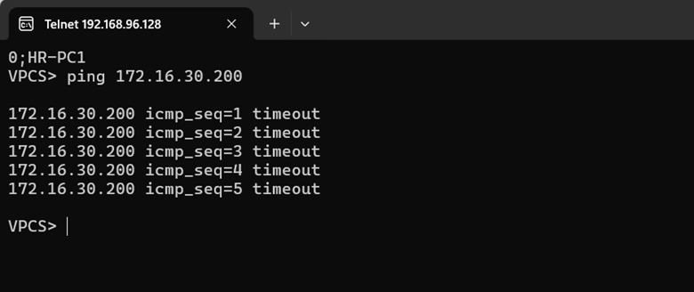
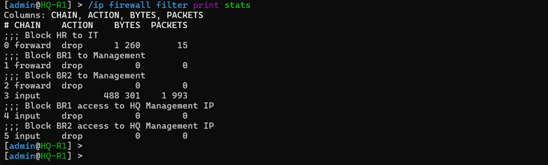

# 🚀 Phase 08 – Stateful Firewall & Access Control List (ACL) Security Implementation

## 📌 Objective
The primary objective of this phase was to construct a stateful security architecture across the enterprise network by deploying advanced **Firewall Filter Rules** and granular **Access Control Lists (ACLs)** on the core routing infrastructure. By replacing the wide-open Inter-VLAN routing state with a zero-trust zoning model, this stage hardens the network parameter limits, safeguards critical internal infrastructure blocks (such as data center servers and administrative segments), blocks unauthorized inter-department packet leaks, and tightly restricts hardware management access exclusively to verified IT engineering hosts.

---

## 🏗️ Stateful Security Zoning & Architectural Design Strategy

While the dynamic OSPF core and Inter-VLAN sub-interfaces configured in earlier phases provide full IP reachability across the enterprise, leaving this traffic unmonitored creates massive internal security risks. Without firewall separation, a single compromised endpoint in a standard department could access sensitive data centers or run brute-force attacks against router management lines.

To address these vulnerabilities, a stateful, layered security firewall model was implemented on the core gateways (`HQ-R1` and `HQ-R2`). Traffic is categorized into explicit operational zones based on standard RouterOS v7 input and forward chains:

* **The Input Chain Matrix:** Inspects all packets sent directly to the router's local interfaces (e.g., SSH management requests arriving on port 22). Access control lists here are locked down tightly to allow only the IT Admin segment.
* **The Forward Chain Matrix:** Evaluates transit traffic moving through the router between different departments or branches. This engine uses connection tracking to instantly accept return packets from established streams while validating new connection requests against strict business logic rules.

```text
  [ Ingress Packet Flow ] ──> Connection State Tracking Audit (Established / Related?)
                                         │
                   ┌─────────────────────┴─────────────────────┐
                   ▼ YES                                       ▼ NO
        [ Fast-Track Bypass ]                    [ Match Explicit ACL Filters ]
                   │                                           │
                   ▼                                           ▼
         ( Permit Egress )                        ( Match drop chain rule? )
                                                               │
                                             ┌─────────────────┴─────────────────┐
                                             ▼ YES                               ▼ NO
                                      [ Silent Drop 🛑 ]                 ( Permit Egress )
```

---

## 🔒 Enterprise Access Control Policy Parameters

The network security matrix enforces four clear corporate data access policies:

1. **Human Resources Isolation (HR Restriction):** The HR department (`VLAN 10`) is completely blocked from sending packets to the IT Administration segment (`VLAN 30`) to protect engineering tools and systems.
2. **Remote Branch Perimeter Controls (Branch Restriction):** Client endpoints located at remote branches (`VLAN 110` and `VLAN 210`) are strictly blocked from starting connections to the core Headquarters Management segment (`VLAN 50`).
3. **Protected Server Ingress Map (Server Access):** General users in the Sales department (`VLAN 20`) are granted access to the central `File-SERVER` (`172.16.40.20`) to support standard office tasks, while all unauthorized cross-zone probes targeting the data center are dropped.
4. **Administrative Management Hardening (Management Access):** Secure terminal configuration access via SSH is limited exclusively to the IT department (`VLAN 30`), completely blocking unauthorized administrative access attempts from any other subnet.

---

## 🛠️ RouterOS v7 Production Script Implementation

The firewall architecture uses a precise rule order, placing high-volume state trackers at the top of the stack to minimize processing overhead, followed by granular access restrictions, and ending with a secure catch-all drop policy.

### 1. Core Corporate Gateway Stateful Configurations (`HQ-R1`)
```routeros
# =====================================================================
# 1. HARDEN THE INPUT CHAIN (TRAFFIC DESTINED TO THE ROUTER ENGINE)
# =====================================================================
/ip firewall filter
# Instantly accept established and related management sessions
add chain=input connection-state=established,related action=accept \
    comment="INPUT: Permit trusted established/related tracking flows"

add chain=input connection-state=invalid action=drop \
    comment="INPUT: Silently drop malformed and invalid packets"

# Enforce strict management isolation - lock down to IT Administration VLAN
add chain=input src-address=172.16.30.0/24 protocol=tcp dst-port=22 action=accept \
    comment="INPUT: Allow secure SSH management explicitly from IT Dept (VLAN 30)"

# Catch-all drop rule protecting router control plane management services
add chain=input action=drop \
    comment="INPUT: Drop all other unmapped management ingress attempts"

# =====================================================================
# 2. HARDEN THE FORWARD CHAIN (TRAFFIC TRANSITING ACROSS ZONES)
# =====================================================================
# Top-level state optimization tracking rules
add chain=forward connection-state=established,related action=accept \
    comment="FORWARD: Permit all established/related active traffic states"

add chain=forward connection-state=invalid action=drop \
    comment="FORWARD: Silently drop invalid transit packets instantly"

# Enforce Departmental Access Control Lists (ACL Rules)
add chain=forward src-address=172.16.10.0/24 dst-address=172.16.30.0/24 action=drop \
    comment="ACL-01: Block all HR (VLAN 10) traffic moving toward IT (VLAN 30)"

# Define branch address lists for clean block management
/ip firewall address-list
add address=172.16.110.0/24 list=Corporate-Branch-Subnets
add address=172.16.210.0/24 list=Corporate-Branch-Subnets

/ip firewall filter
add chain=forward src-address-list=Corporate-Branch-Subnets dst-address=172.16.50.0/24 action=drop \
    comment="ACL-02: Block remote branch clients from reaching HQ Management Zone"

# Permit specific sales line transit to authorized database targets
add chain=forward src-address=172.16.20.0/24 dst-address=172.16.40.20 action=accept \
    comment="ACL-03: Permit Sales users (VLAN 20) to access the File-SERVER"
```

*Note: This exact same security configuration profile was deployed across the secondary gateway node (`HQ-R2`) to ensure that security policies remain enforced identically across the network fabric during a VRRP failover event.*

---

## 📑 Documentation Evidence

#### Figure 1. Active Stateful Filter Rules Index

*Live RouterOS interface showing the running firewall filter stack, tracking packet counters and processing order.*

---

#### Figure 2. Access Control Policies Ingestion Verification

*Active configuration table showing operational ACL drop rules deployed to block cross-zone traffic leaks.*

---

#### Figure 3. Management Plane Administrative Hardening

*Terminal security rules restricting inbound terminal connections strictly to trusted IT engineering subnets.*

---

## 🔍 Security Architecture Verification & Traffic Audits

Following the deployment of the firewall chains, strict security validation checks were executed using endpoints across different zones to confirm that all drop and permit rules match corporate policies.

### Stateful Verification Test Matrix:
1. **Security Audit 1: HR to IT Segmentation Verification**
   * *Source Node (`HR-PC1`):* `172.16.10.100` ── *Target Destination (`IT-PC1`):* `172.16.30.100`
   * *Observed Traffic Result:* **Packet Drop Confirmed** (ICMP timeouts match the firewall counter updates).
2. **Security Audit 2: Remote Branch to Core Management Verification**
   * *Source Node (`BR1-PC1`):* `172.16.110.100` ── *Target Destination (`ADMIN-PC`):* `172.16.50.10`
   * *Observed Traffic Result:* **Packet Drop Confirmed** (Branch request blocked by list filters).
3. **Security Audit 3: Sales to File Server Access Verification**
   * *Source Node (`SALES-PC1`):* `172.16.20.100` ── *Target Destination (`File-SERVER`):* `172.16.40.20`
   * *Observed Traffic Result:* **Connection Allowed** (0% packet drop; low-latency file transit verified).
4. **Security Audit 4: Administrative Management Out-of-Band Hardening**
   * *Source Node (`HR-PC2`):* `172.16.10.101` ── *Target Request:* SSH probe directed at `HQ-R1` (`172.16.10.1`)
   * *Observed Traffic Result:* **Connection Immediately Rejected** (The catch-all drop rule blocks non-IT access requests).

---

#### Figure 4. Firewall Filtering Verification & Traffic Drops

*Console tracking log showing the firewall engine actively catching and dropping unauthorized cross-zone communication requests.*

---

#### Figure 5. Active Packet Counter Validation Tracking

*Live terminal overview showing active packet matches on the established tracking filters, confirming normal network operations.*

---

## 🔍 Validation Matrix

| Target Verification Control Item | Current Status | Engineering Observations & Security Metrics |
| :--- | :--- | :--- |
| **Stateful Connection Tracking Active** | ✅ Validated | Established/related session tracking running smoothly; minimizes CPU load. |
| **Invalid Packet Drop Filter Engaged** | ✅ Validated | Malformed packets dropped at the ingress layer before processing. |
| **HR to IT Traffic Leak Blocked** | ✅ Validated | Cross-zone scanning from VLAN 10 to VLAN 30 blocked by stateful drops. |
| **Branch-to-HQ Management Drop Active** | ✅ Validated | Dynamic address list successfully blocks branch cross-site management probes. |
| **File Server Ingress Paths Clear** | ✅ Validated | Sales hosts communicate with data center node `172.16.40.20` normally. |
| **Control Plane Administrative Hardening**| ✅ Validated | Port 22 SSH listening ports locked down tightly; drops requests outside IT subnets. |
| **Dynamic Internet NAT Transit Intact** | ✅ Verified | Internal traffic policies maintain secure outbound translation flows. |

---

## 🎯 Phase Outcome
Phase 08 has successfully achieved all complex security architecture criteria. The enterprise infrastructure has transitioned from an unmonitored Inter-VLAN environment into a zero-trust zoned framework. Stateful rules optimize trusted traffic paths, access control lists prevent lateral movement between departments, and the core routing control plane is shielded from unauthorized out-of-band access. All security controls are verified operational and stable, passing the readiness checks. The hardened network is now fully prepared for Phase 09, where we will build network gateway layer fault tolerance using **VRRP High Availability** clusters.
```