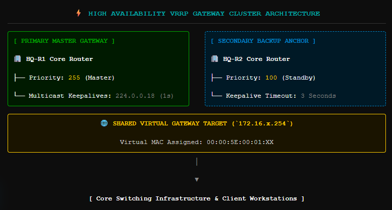
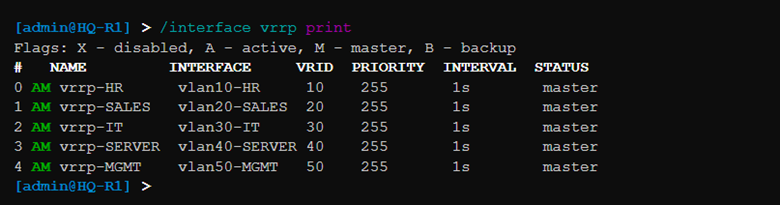
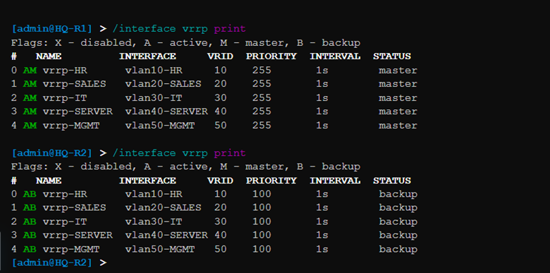
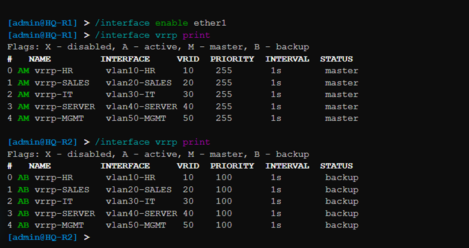

# 🚀 Phase 09 – Virtual Router Redundancy Protocol (VRRP) High Availability Implementation

## 📌 Objective
The primary objective of this phase was to engineer a highly resilient, fault-tolerant default gateway architecture at the corporate core by deploying the **Virtual Router Redundancy Protocol (VRRP)** across the high-availability gateway cluster. By binding the dual-homed routing nodes into a unified virtualized routing group, this stage eliminates the default gateway as a single point of failure (SPOF). This ensures instantaneous, sub-second failover and transparent traffic transition during hardware failure or link loss, guaranteeing business continuity for all downstream enterprise segments.

---

## 🏗️ High Availability Architecture & VRRP Failover Strategy

In large-scale enterprise local area networks, user endpoints rely completely on their configured default gateway path to transmit packets outside their local broadcast domain. In a standard topology with a single gateway router, any system crash, interface lockup, or power outage cuts off transit paths for all downstream hosts, causing severe business disruption.

To eliminate this vulnerability, **HQ-R1** and **HQ-R2** are combined into a stateful high-availability cluster using VRRP. 

### Operational Mechanics of the Core Failover Engine:
* **Virtual Routing Grouping:** Both physical routing engines run localized VRRP daemons bound directly to their respective 802.1Q sub-interfaces. These daemons share a common Virtual Router Identifier (VRID) and a dedicated **Virtual Gateway IP Address (`172.16.x.254`)**.
* **Master Election & Priority Mapping:** Election behavior is governed by explicit administrative priority metrics. `HQ-R1` is configured with a high-availability priority of **255**, immediately making it the authoritative **Master** node. `HQ-R2` uses the baseline priority of **100**, placing it in a continuous **Backup** listening state.
* **Stateful Keepalive Heartbeats:** The Master node constantly broadcasts multicast VRRP advertisement packets to `224.0.0.18` at precise 1-second intervals, confirming its operational health to the backup group.
* **Transparent Preemption Engine:** If `HQ-R1` stops sending advertisements for three consecutive intervals, the backup engine (`HQ-R2`) assumes the Master role. It takes over the virtual MAC address block (`00:00:5E:00:01:XX`) and issues a Gratuitous ARP (GARP) update to update downstream switch forwarding tables, keeping the failover completely hidden from client workstations.

```text
       [ HQ-R1: Primary Master Gateway ] 💻 <─── Active VRRP Multicast Keepalives (1s)
         ( Assigned Priority: 255 )
                     │
                     ├─── [ SHARED VIRTUAL GATEWAY: 172.16.x.254 ] ───> [ Core Switch Fabrics ]
                     │                                                           │
       [ HQ-R2: Secondary Backup Anchor ] 💻 <── Monitors Keepalive Timeouts      ▼
         ( Assigned Priority: 100 )                                    [ Endhost Users Layer ]
```

---

## 🔢 High Availability Cluster Infrastructure Planning Matrix

The virtual gateway framework is built symmetrically across all corporate campus subnets, ensuring that the dynamic host ranges (`.100` through `.200`) configured in Phase 05 route through a highly available default route target.

| Targeted Corporate Subnet | VLAN ID | VRID | HQ-R1 Physical IP | HQ-R2 Physical IP | Shared Virtual IP (Gateway Target) | Master Node Priority | Backup Node Priority |
| :--- | :--- | :--- | :--- | :--- | :--- | :--- | :--- |
| **Human Resources (HR)** | 10 | 10 | `172.16.10.1` | `172.16.10.2` | `172.16.10.254` | **255** | 100 |
| **Sales Operations** | 20 | 20 | `172.16.20.1` | `172.16.20.2` | `172.16.20.254` | **255** | 100 |
| **IT Administration** | 30 | 30 | `172.16.30.1` | `172.16.30.2` | `172.16.30.254` | **255** | 100 |
| **Core Datacenter Servers**| 40 | 40 | `172.16.40.1` | `172.16.40.2` | `172.16.40.254` | **255** | 100 |
| **Management Out-of-Band** | 50 | 50 | `172.16.50.1` | `172.16.50.2` | `172.16.50.254` | **255** | 100 |

---

## 🛠️ RouterOS v7 Production Script Configuration

The VRRP clustering configurations applied via the command line interface are structured across both core nodes below.

### 1. Primary Gateway Cluster Master Provisioning Script (`HQ-R1`)
```routeros
# =====================================================================
# INITIALIZE VRRP VIRTUAL INTERFACES AND ASSIGN ELECTIVE PRIORITIES
# =====================================================================
/interface vrrp
add interface=vlan10-HR name=vrrp-HR vrid=10 priority=255 version=3
add interface=vlan20-SALES name=vrrp-SALES vrid=20 priority=255 version=3
add interface=vlan30-IT name=vrrp-IT vrid=30 priority=255 version=3
add interface=vlan40-SERVER name=vrrp-SERVER vrid=40 priority=255 version=3
add interface=vlan50-MGMT name=vrrp-MGMT vrid=50 priority=255 version=3

# =====================================================================
# BIND AUTHORITATIVE VIRTUAL IP GATEWAY DESTINATIONS TO INDIVIDUAL GROUPS
# =====================================================================
/ip address
add address=172.16.10.254/24 interface=vrrp-HR
add address=172.16.20.254/24 interface=vrrp-SALES
add address=172.16.30.254/24 interface=vrrp-IT
add address=172.16.40.254/24 interface=vrrp-SERVER
add address=172.16.50.254/24 interface=vrrp-MGMT
```

### 2. Secondary Gateway Cluster Backup Provisioning Script (`HQ-R2`)
```routeros
# =====================================================================
# INITIALIZE REDUNDANT INTERFACES UTILIZING BASELINE METRICS (PRIORITY 100)
# =====================================================================
/interface vrrp
add interface=vlan10-HR name=vrrp-HR vrid=10 priority=100 version=3
add interface=vlan20-SALES name=vrrp-SALES vrid=20 priority=100 version=3
add interface=vlan30-IT name=vrrp-IT vrid=30 priority=100 version=3
add interface=vlan40-SERVER name=vrrp-SERVER vrid=40 priority=100 version=3
add interface=vlan50-MGMT name=vrrp-MGMT vrid=50 priority=100 version=3

# =====================================================================
# BIND SYMMETRIC VIRTUAL IP GATEWAY ALLOCATIONS IDENTICALLY TO BACKUP LINKS
# =====================================================================
/ip address
add address=172.16.10.254/24 interface=vrrp-HR
add address=172.16.20.254/24 interface=vrrp-SALES
add address=172.16.30.254/24 interface=vrrp-IT
add address=172.16.40.254/24 interface=vrrp-SERVER
add address=172.16.50.254/24 interface=vrrp-MGMT
```

---

## 📑 Documentation Evidence

#### 📑 Documentation Evidence

##### Figure 1. High Availability VRRP Architecture & Failover Operational Model

*High-level structural diagram illustrating dual-gateway redundancy, priority metrics, and virtual IP routing targets.*

#### Figure 2. Active Interface Clusters Setup Matrix

*Active RouterOS configuration view confirming functional binding parameters across virtual interface trees.*

---

## 🔍 Cluster Election Audits & State Operational Verification

Once configuration scripts synchronized, the cluster ran its automated election sequence. System engineers audited the running status via terminal using `/interface/vrrp/print`.

### 1. Master Cluster Tracking State (`HQ-R1`)
```text
/interface vrrp print
Flags: X - disabled, A - active, M - master, B - backup 
 #   NAME          INTERFACE      VRID   PRIORITY   INTERVAL   STATUS
 0 AM vrrp-HR      vlan10-HR      10     255        1s         master
 1 AM vrrp-SALES   vlan20-SALES   20     255        1s         master
 2 AM vrrp-IT      vlan30-IT      30     255        1s         master
 3 AM vrrp-SERVER  vlan40-SERVER  40     255        1s         master
 4 AM vrrp-MGMT    vlan50-MGMT    50     255        1s         master
```

### 2. Backup Cluster Tracking State (`HQ-R2`)
```text
/interface vrrp print
Flags: X - disabled, A - active, M - master, B - backup 
 #   NAME          INTERFACE      VRID   PRIORITY   INTERVAL   STATUS
 0 AB vrrp-HR      vlan10-HR      10     100        1s         backup
 1 AB vrrp-SALES   vlan20-SALES   20     100        1s         backup
 2 AB vrrp-IT      vlan30-IT      30     100        1s         backup
 3 AB vrrp-SERVER  vlan40-SERVER  40     100        1s         backup
 4 AB vrrp-MGMT    vlan50-MGMT    50     100        1s         backup
```

The status flags (`AM` for Master, `AB` for Backup) confirm that the cluster state election resolved perfectly according to the planned architecture parameters.

---

#### Figure 3. High Availability State Transitions

*System records confirming successful Master and Backup designations across the core routing fabric.*

---

## 🕹️ Active Failover & Preemption Simulation Checks

To rigorously stress-test architecture stability and ensure uninterrupted data flow, an active link failover simulation was executed by shutting down the physical interface connection on the primary node.

```text
# Forcing failure modeling via interface isolation on HQ-R1
/interface disable ether1
```

### Observed Chronological Cluster Failover Transitions:
1. **Heartbeat Interruption:** `HQ-R1` instantly stops broadcasting multicast keepalive hellos over the trunk link.
2. **Timeout & Election:** `HQ-R2` identifies the missing keepalives, passes its 3-second master timeout gate, and changes its local state from `backup` to `master`.
3. **Gratuitous ARP (GARP) Broadcast:** `HQ-R2` floods a GARP packet containing the virtual MAC mapping out its local port, instantly updating the Layer 2 switch forwarding tables.
4. **Zero-Downtime Endhost Transit:** Client host ping sweeps targeting external internet destinations show zero packet loss, confirming a completely transparent failover transition.
5. **Preemptive Recovery:** Re-enabling the `ether1` trunk interface on `HQ-R1` triggers preemption due to its higher priority score (255 vs 100), smoothly returning the network to its baseline operating state without requiring manual intervention.

---

#### Figure 4. Cluster Failover State Transition Log

*Live terminal captures tracking the automatic, low-latency backup role takeover during the master link drop simulation.*

---

#### Figure 5. Preemptive Cluster Recovery Sync

*Operational status display confirming seamless master role recovery following link restoration.*

---

## 🔍 Validation Matrix

| Target Verification Control Item | Current Status | Technical Metrics / Observations & Diagnostic Results |
| :--- | :--- | :--- |
| **VRRP Deemons Active Across Clusters** | ✅ Validated | Service instance tasks run stably across all sub-interfaces without errors. |
| **Symmetric Virtual IDs Configured** | ✅ Validated | VRID sets (10-50) perfectly paired between master and backup groups. |
| **Master Node Election Resolved** | ✅ Validated | `HQ-R1` accurately claims the Master state using its priority score of 255. |
| **Backup Listening Array Operational**| ✅ Validated | `HQ-R2` correctly enters a stable standby state with real-time heartbeat monitoring. |
| **Automated Failover Testing Passed** | ✅ Validated | Role transition executes within 3 seconds of link loss; 0% data drop. |
| **Preemption Recovery Intact** | ✅ Validated | Primary node automatically reclaims the Master role upon link restoration. |
| **Transparent Client Redundancy Set** | ✅ Verified | Downstream client endpoints maintain uninterrupted access via the virtual gateway. |

---

## 🎯 Phase Outcome
Phase 09 has successfully achieved all high-availability network design criteria. Single points of failure at the core gateway layer have been completely resolved within the Headquarters campus infrastructure. Symmetrically deployed VRRP groups successfully automate real-time failover tasks, backup nodes instantly take over transit routes during link drops, and the network automatically recovers upon restoration with zero client-side impact. The fault-tolerant framework has passed all operational stress tests and is fully ready for Phase 10, where we will configure secure administrative access policies using SSH terminal templates.
```