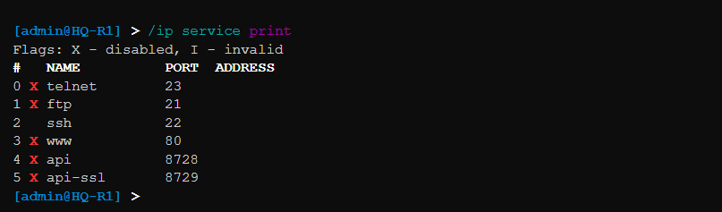
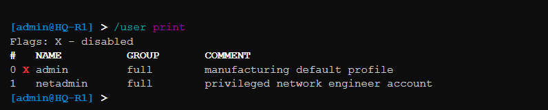
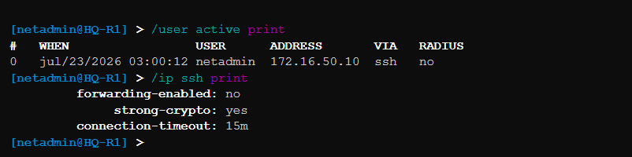

# Phase 10 – SSH Configuration

## Objective

The objective of this phase was to implement Secure Shell (SSH) for the secure remote management of enterprise network devices. SSH replaces insecure remote management protocols by encrypting all communication between administrators and network devices, ensuring confidentiality, integrity, and authentication.

---

# Secure Remote Management Overview

Managing enterprise routers through direct console access is practical only during initial deployment. As enterprise networks grow, administrators require a secure method to configure, monitor, and troubleshoot devices remotely.

Secure Shell (SSH) was implemented to provide encrypted remote access to MikroTik routers. Unlike Telnet, which transmits data in plain text, SSH encrypts all authentication credentials and management traffic, protecting administrative sessions from interception.

The implementation provides:

- Secure remote administration.
- Encrypted communication.
- Administrator authentication.
- Protection against credential theft.
- Improved enterprise security.

---

# SSH Design Strategy

The SSH deployment was designed to ensure that only authorized administrators could remotely access enterprise networking devices.

The design objectives included:

- Secure administrator authentication.
- Encrypted management sessions.
- Restricted access to trusted users.
- Elimination of insecure remote management protocols.
- Simplified enterprise administration.

By implementing SSH, the enterprise network significantly improves the security of its management infrastructure.

---

# SSH Service Configuration

The SSH service was enabled on the MikroTik routers.

Configuration tasks included:

- Enabling the SSH service.
- Configuring the listening port.
- Creating administrator credentials.
- Enabling encrypted remote login.
- Verifying SSH availability.

The configuration allows network administrators to securely manage routers from remote locations.

### Documentation Evidence

#### Figure 1. SSH Service Configuration

*SSH service enabled on the MikroTik router.*

---

# Administrator Account Configuration

Dedicated administrator credentials were configured for secure authentication.

Proper account management helps prevent unauthorized access while maintaining accountability for administrative activities.

Security considerations included:

- Strong administrator credentials.
- Restricted administrative access.
- Secure authentication process.
- Controlled management privileges.

### Documentation Evidence

#### Figure 2. Administrator Account Configuration

*Administrator account configured for secure SSH access.*

---

# Remote Login Verification

After configuration, remote SSH login was tested from an administrative workstation.

The verification confirmed:

- Successful authentication.
- Encrypted communication.
- Administrative access to the router.
- Stable remote management session.

Successful login demonstrated that SSH was operating correctly.

### Documentation Evidence

#### Figure 3. SSH Login Verification

*Successful SSH login to the enterprise router.*

---

# Secure Management Validation

Additional validation was performed to confirm that remote management complied with enterprise security requirements.

The validation confirmed:

- SSH service running correctly.
- Remote management available.
- Encrypted management sessions established.
- Administrative authentication functioning properly.
- Secure device management operational.

### Documentation Evidence

#### Figure 4. Secure Management Validation

*Validation of secure remote management through SSH.*

---

# Enterprise Benefits

The implemented SSH solution provides several operational advantages.

| Benefit | Description |
|----------|-------------|
| Encrypted Communication | Protects management traffic |
| Secure Authentication | Prevents unauthorized access |
| Remote Administration | Manage devices from remote locations |
| Improved Security | Replaces insecure management protocols |
| Centralized Management | Simplifies enterprise administration |
| Reduced Operational Cost | Minimizes on-site maintenance requirements |
| Industry Standard | Widely adopted secure management protocol |

---

# Phase Verification

The SSH implementation was verified before proceeding to centralized logging.

| Verification Item | Status |
|-------------------------------|--------|
| SSH Service Enabled | ✅ |
| Administrator Account Configured | ✅ |
| Secure Authentication Verified | ✅ |
| Remote Login Successful | ✅ |
| Encrypted Session Established | ✅ |
| Remote Device Management Verified | ✅ |
| Enterprise Security Improved | ✅ |
| Ready for Syslog Configuration | ✅ |

---

# Outcome

This phase successfully implemented Secure Shell (SSH) for enterprise network management. Encrypted remote access was established, allowing administrators to securely configure and monitor network devices without exposing management traffic or authentication credentials. The enterprise infrastructure now supports secure remote administration and is prepared for centralized logging using Syslog in the next phase.