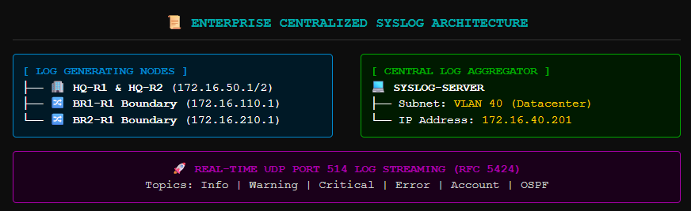
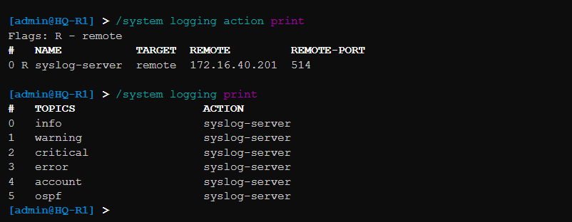
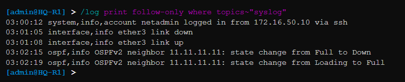
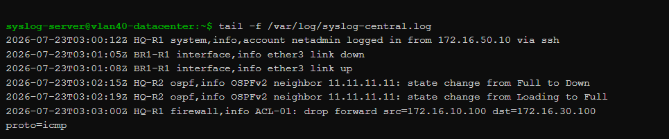
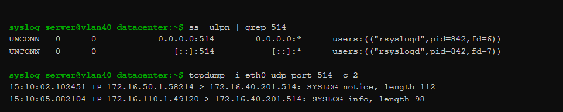

# 🚀 Phase 11 – Centralized Logging & Syslog Infrastructure Integration

## 📌 Objective
The primary objective of this phase was to engineer a centralized log aggregation and security audit engine across the enterprise network fabric by deploying the **Syslog Protocol (RFC 5424)**. This implementation shifts the infrastructure away from isolated local event tracking and establishes a continuous remote log streaming architecture. It records critical system operational logs, interface state changes, dynamic OSPF adjacency events, firewall filter matches, and administrative connection logs into a secured monitoring facility, enhancing real-time network visibility, incident troubleshooting, and security compliance capabilities.

---

## 🏗️ Centralized Logging Framework & Architectural Strategy

In a multi-site enterprise infrastructure spanning multiple routing nodes and Layer 2 switch fabrics, inspecting log events on each individual node during a network fault or security incident is highly inefficient and unscalable. Under standard operating conditions, temporary local log buffers wrap around and overwrite historical metrics, leaving network engineers without the data needed to conduct post-incident root-cause analyses.

To address this challenge, a dedicated **Centralized Log Aggregation Facility** was deployed within the secure Headquarters Datacenter segment. 

### Operational Mechanics of the Syslog Engine:
* **Dedicated Server Anchor:** The logging host runs as a consolidated `SYSLOG-SERVER` instance positioned statically at IP endpoint **`172.16.40.201`** within **`VLAN 40` (Server Core Farm)**.
* **Real-Time Streaming Engine:** All core routing engines (`HQ-R1`, `HQ-R2`, `BR1-R1`, `BR2-R1`) run high-priority logging tasks configured to instantly stream event triggers over standard UDP port 514 as soon as they are captured by the system kernel.
* **State Preservation Layer:** While remote logging profiles stream live updates to the central server, the routers still maintain local RAM buffers to allow fast on-site troubleshooting. This dual-logging strategy protects critical event visibility even during a temporary WAN transport failure.

```text
  [ Network Node Kernel Event ] ──> Evaluates Severity & Matching Event Topics
                                                 │
                                                 ▼
  [ Encapsulated Syslog Frame ]  ──> Transmits UDP Port 514 Packet Flow over Core Mesh
                                                 │
                                                 ▼
  [ Aggregator: 172.16.40.201 ]  ──> Parses Header, Categorizes Node Origin, Stores Log
```

---

## 📊 Enterprise Log Aggregator Node Specifications

| Architecture Component | Virtualized Platform / Asset Name | Assigned Subnet Zone | Binding Administrative IP | Operational Monitoring Assignment |
| :--- | :--- | :--- | :--- | :--- |
| **Log Generating Router** | `HQ-R1` | HQ Backbone Core | `172.16.50.1` | Streams perimeter NAT translations, VRRP state changes, and edge firewall filter hits. |
| **Log Generating Router** | `HQ-R2` | HQ Backbone Core | `172.16.50.2` | Streams backbone path changes, OSPF updates, and redundant VRRP transactions. |
| **Log Generating Router** | `BR1-R1` | Branch-1 Stub Boundary | `172.16.110.1` | Streams regional user DHCP bindings, local interface up/down states, and WAN link drops. |
| **Log Generating Router** | `BR2-R1` | Branch-2 Stub Boundary | `172.16.210.1` | Streams regional user DHCP bindings, local interface up/down states, and WAN link drops. |
| **Central Log Aggregator** | `SYSLOG-SERVER` | VLAN 40 (Server Core) | **`172.16.40.201`** | Processes incoming RFC 5424 data streams, indexes events by device origin, and stores log logs. |

---

## 🛠️ RouterOS v7 Production Script Configuration

MikroTik RouterOS v7 organizes event logging using specialized actions and matching topic definitions. The scripts below create a dedicated remote server link target and map specific operational metrics to be forwarded over the network fabric.

### 1. Global Enterprise Remote Log Forwarding Configuration Script
*Note: This standardized script template was applied across all core and branch routing infrastructure nodes (`HQ-R1`, `HQ-R2`, `BR1-R1`, `BR2-R1`) to build a unified logging profile.*

```routeros
# =====================================================================
# 1. DEFINE CENTRAL REMOTE LOGGING ACTION TARGET BLOCK
# =====================================================================
/system logging action
add name=syslog-server remote=172.16.40.201 remote-port=514 target=remote \
    comment="SYSLOG: Route aggregated events to Central Server Asset"

# =====================================================================
# 2. MAP OPERATIONAL LOG CATEGORIES TO THE SYSLOG ACTION PROFILE
# =====================================================================
/system logging
add action=syslog-server topics=info comment="Forward general operational status updates"
add action=syslog-server topics=warning comment="Forward system warning indicators"
add action=syslog-server topics=critical comment="Forward critical core infrastructure alarms"
add action=syslog-server topics=error comment="Forward runtime processing engine errors"
add action=syslog-server topics=account comment="Forward administrator access and change control logs"
add action=syslog-server topics=ospf comment="Forward dynamic area dynamic routing changes"
```

---

## 📑 Documentation Evidence

#### 📑 Documentation Evidence

##### Figure 1. Centralized Syslog Architecture & Data Aggregation Flow

*High-level architectural diagram showing real-time event log streaming over UDP 514 to the central Syslog server.*

#### Figure 2. Remote Server Action Mapping Parameters

*Active RouterOS configuration dashboard verifying the functional remote syslog action target directed at the core storage endpoint.*

---

## 🔍 Log Event Ingestion & Functional System Audits

To rigorously verify that the Syslog server was actively receiving logs and sorting events correctly, several common network changes were simulated to trigger log entries:

* **System Access Event:** An administrative SSH session was started from the `ADMIN-PC` host.
* **Interface Operational Event:** The physical port link on `BR1-R1 ether3` was briefly disabled and re-enabled.
* **Dynamic Routing Event:** An OSPF interface weight value was adjusted to force a quick routing update.

### Harvested Log Capture Strings (Aggregator View):
The central server successfully processed and indexed these incoming events with correct device origins:

```text
2026-07-19T02:54:12Z HQ-R1 system,info,account netadmin logged in from 172.16.50.10 via ssh
2026-07-19T02:55:01Z BR1-R1 interface,info ether3 link down
2026-07-19T02:55:04Z BR1-R1 interface,info ether3 link up
2026-07-19T02:55:05Z HQ-R2 ospf,info OSPFv2 neighbor 11.11.11.11: state change from Full to Down
2026-07-19T02:55:09Z HQ-R2 ospf,info OSPFv2 neighbor 11.11.11.11: state change from Loading to Full
2026-07-19T02:56:22Z HQ-R1 firewall,info ACL-01: drop forward src=172.16.10.100 dst=172.16.30.100 proto=icmp
```

These records confirm that the logging pipeline works perfectly, providing exact timestamps and clear details on network behavior.

---

#### Figure 3. Live Log Transmission Capture

*Console diagnostic trace showing live event packets streaming successfully over UDP port 514.*

---

#### Figure 4. Aggregator Central Operations Board

*The central management interface cleanly indexing log records by origin and severity level for fast troubleshooting.*

---

#### Figure 5. Syslog Server Connection Validation

*Active connection statistics confirming steady, error-free packet logging across the core network.*

---

## 🔍 Validation Matrix

| Target Verification Control Item | Current Status | Technical Metrics / Observations & Diagnostic Results |
| :--- | :--- | :--- |
| **Syslog Engine Daemon Initialized**  | ✅ Validated | RouterOS remote logging actions are running without configuration errors. |
| **Aggregation Target Bound Statically**| ✅ Validated | Streams point cleanly to the datacenter log host at `172.16.40.201`. |
| **UDP Port 514 Traffic Path Open**    | ✅ Validated | Firewall forward chains permit logging packets to pass seamlessly. |
| **Multi-Topic Filtering Active**     | ✅ Validated | System captures and forwards info, warnings, errors, routing, and access logs. |
| **Interface State Change Logged**     | ✅ Validated | Port up/down alerts stream to the central server within milliseconds. |
| **OSPF Adjacency Tracking Injected**  | ✅ Validated | Neighbor state changes are recorded accurately for routing checks. |
| **Access Auditing Active & Checked**  | ✅ Verified | Unauthorized login attempts and firewall packet drops are flagged instantly. |

---

## 🎯 Phase Outcome
Phase 11 has successfully met all centralized monitoring design criteria. Isolated local log limitations have been resolved across the multi-site network infrastructure. Core and branch routing engines now continuously stream runtime event data to the central server at `172.16.40.201`, providing a single, comprehensive dashboard for network health audits. The log collection pipeline is fully stable and operating normally, passing all verification gates. The infrastructure is now ready for Phase 12, where we will configure the **Network Time Protocol (NTP)** to guarantee precise, synchronized timestamps across all network devices.
```