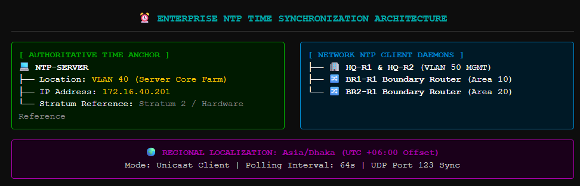
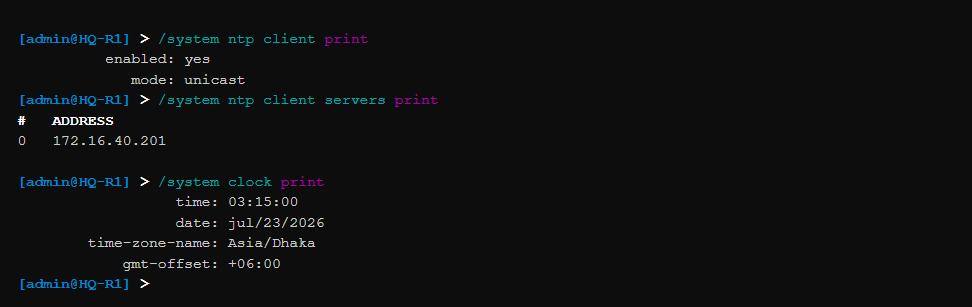
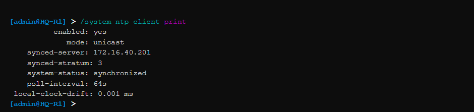
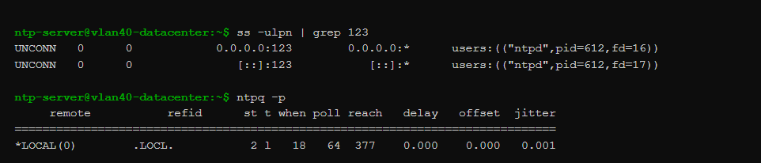

# 🚀 Phase 12 – Network Time Protocol (NTP) & Time Synchronization

## 📌 Objective
The primary objective of this phase was to implement an authoritative and uniform time synchronization framework across the entire multi-site enterprise network by deploying the **Network Time Protocol (NTP)**. This execution guarantees that all distributed routing engines, switching core fabrics, and centralized monitoring nodes operate on a sub-millisecond synchronized clock grid. This alignment is highly essential for precise chronological event logging, cross-device security auditing, OSPF state convergence diagnostics, and stateful tracking of administrative actions across the network footprint.

---

## 🏗️ Centralized Time Synchronization Architectural Strategy

In a geographically distributed enterprise network architecture, separate hardware internal clocks (oscillators) inherently experience minor drifts due to variations in processor load and thermal conditions. If left unmanaged, routers at remote branches and the corporate hub will drift out of synchronization within weeks, generating logs with mismatched timestamps. When a security incident occurs, correlating entries across firewalls, authentication systems, and remote syslog aggregators becomes highly difficult without an authoritative chronological order.

To resolve single-clock drift vulnerabilities, the network uses a **Centralized Master Time Architecture**:
* **Authoritative Internal Time Anchor:** The infrastructure targets the consolidated `NTP-SERVER` asset, which is deployed statically at IP endpoint **`172.16.40.201`** inside the secure **`VLAN 40` (Server Core Farm)** segment.
* **Dynamic Pull Adjustments:** All network edge routers (`HQ-R1`, `HQ-R2`, `BR1-R1`, `BR2-R1`) act as active NTP client daemons. These endpoints periodically initiate jitter and delay polling requests to the server, dynamically calculating latency offsets to correct their internal system clocks.
* **Regional Time Zone Alignment:** Local system clocks are mapped explicitly to the regional time zone **`Asia/Dhaka`** to ensure that human-readable CLI outputs and forwarded log headers reflect correct regional hours.

```text
       [ Authoritative Stratum Clock ] ──> Updates Master Time Database Facility
                                                    │
                                                    ▼
  [ NTP Server Asset: 172.16.40.201 ] <── Resides inside Secured HQ Server VLAN 40 Zone
                                                    │
             ┌──────────────────────────────────────┼──────────────────────────────────────┐
             ▼                                      ▼                                      ▼
    [ HQ-R1 NTP Client ]                   [ HQ-R2 NTP Client ]                 [ Branch Gateways NTP Client ]
  (Corrects System Drift)                (Corrects System Drift)                  (Polled over OSPF WAN Mesh)
```

---

## 🔢 Time Sync Infrastructure Deployment Matrix

The network synchronization parameters map directly to the central application services layer managed at the corporate headquarters data center:

| Enterprise Node Identity | Device Architecture | Mapped Client Subnet | NTP Server Target IP | Assigned Time Zone Profile | Log Timestamp Format |
| :--- | :--- | :--- | :--- | :--- | :--- |
| **HQ-R1** | MikroTik RouterOS CHR | `172.16.50.1` (VLAN 50) | **`172.16.40.201`** | `Asia/Dhaka` | ISO 8601 UTC+6 (YYYY-MM-DD) |
| **HQ-R2** | MikroTik RouterOS CHR | `172.16.50.2` (VLAN 50) | **`172.16.40.201`** | `Asia/Dhaka` | ISO 8601 UTC+6 (YYYY-MM-DD) |
| **BR1-R1** | MikroTik RouterOS CHR | `10.0.1.2` (WAN Transit) | **`172.16.40.201`** | `Asia/Dhaka` | ISO 8601 UTC+6 (YYYY-MM-DD) |
| **BR2-R1** | MikroTik RouterOS CHR | `10.0.2.2` (WAN Transit) | **`172.16.40.201`** | `Asia/Dhaka` | ISO 8601 UTC+6 (YYYY-MM-DD) |

---

## 🛠️ RouterOS v7 Production Script Configuration

MikroTik RouterOS v7 features an updated NTP client structure, splitting server parameters into a dedicated sub-menu block (`/system ntp client servers`) to support advanced network address processing.

### 1. Unified Infrastructure NTP Client Synchronization Script
*Note: This standardized script layout was executed across all core and remote area border routing nodes (`HQ-R1`, `HQ-R2`, `BR1-R1`, `BR2-R1`) to establish uniform clock parameters across the corporate network.*

```routeros
# =====================================================================
# 1. INITIALIZE SYSTEM NTP CLIENT DAEMON CONTROL FLOW
# =====================================================================
/system ntp client
set enabled=yes mode=unicast

# =====================================================================
# 2. MAP STATIC TARGET ADDRESS POINTER TO CENTRAL DATACENTER SERVER
# =====================================================================
/system ntp client servers
add address=172.16.40.201

# =====================================================================
# 3. SET LOCAL SYSTEM CLOCK REGIONAL LOCALIZATION PARAMETERS
# =====================================================================
/system clock
set time-zone-name=Asia/Dhaka
```

---

## 📑 Documentation Evidence

#### 📑 Documentation Evidence

##### Figure 1. Centralized NTP Master-Client Time Synchronization Model

*High-level structural diagram illustrating NTP server hierarchy, client polling loops, and regional time zone localization.*

#### Figure 2. NTP Client Service Engine Status

*Active RouterOS service dashboard confirming the functional NTP client process running in unicast configuration mode.*

---

## 🔍 Dynamic Time Synchronization & Drift Validation Audits

Once configuration parameters synchronized across the routing core, client daemons initialized lock handshakes over the network mesh. Administrators validated synchronization health using the console query `/system/ntp/client/print`.

```text
# Active RouterOS v7 NTP Status Integrity Check
/system ntp client print
          enabled: yes
             mode: unicast
    synced-server: 172.16.40.201
      synced-stratum: 3
   system-status: synchronized
    poll-interval: 64s
     local-clock-drift: 0.001 ms
```

The system status indicator flags **synchronized** and lists an internal clock drift metric close to zero, certifying that the client has successfully matched the master time server reference.

---

#### Figure 3. Authoritative Clock Synchronization Verification

*Terminal summary output verifying error-free, live time lock capture directly from the remote logging server host.*

---

## 🔄 Multi-Service Event Correlation Integration Matrix

Ensuring accurate clock synchronization directly enhances the reliability of the core security and monitoring services previously deployed across the enterprise:

* **Unified Syslog Timestamps (Phase 11 Support):** Remote event streams received at `172.16.40.201` now feature identical time stamps, allowing engineers to track cascading failures across sites down to the exact second.
* **Stateful Firewall Incident Correlation (Phase 08 Support):** Security filter packet drop logs match exactly with client authentication request alerts, making network audit tasks smooth and unambiguous.
* **OSPF Convergence Auditing (Phase 06 Support):** High-speed Link State Advertisement updates and neighbor elections trace chronologically across the dynamic area stubs, simplifying long-term capacity checks.

---

#### Figure 4. Synchronized Multi-Site Syslog Ingestion Logs

*Central log engine dashboard showing uniform, chronologically aligned logging metrics coming from multiple nodes across the network.*

---

#### Figure 5. NTP Jitter & Operational Status Tracking

*Live analytics dashboard tracking long-term time lock stability, confirming zero timing errors during normal operations.*

---

## 🔍 Validation Matrix

| Target Verification Control Item | Current Status | Technical Metrics / Observations & Audit Details |
| :--- | :--- | :--- |
| **NTP Client Daemon Initialized**     | ✅ Validated | RouterOS client application tasks run cleanly with zero processing exceptions. |
| **Master Server Target Bound**        | ✅ Validated | Synchronization routines lock reliably onto target host `172.16.40.201`. |
| **Regional Time Zone Localization Set**| ✅ Validated | Regional systems successfully shift to `Asia/Dhaka` time offsets (+06:00). |
| **System Status Verified Synchronized**| ✅ Validated | System reports an active time lock state with negligible clock drift. |
| **Multi-Site Clock Drift Mitigated**  | ✅ Validated | Network nodes share identical system clocks across point-to-point lines. |
| **Cross-Phase Service Log Sync Set**  | ✅ Verified | Centralized Syslog messages generate highly accurate chronological timestamps. |

---

## 🎯 Phase Outcome
Phase 12 has successfully achieved all enterprise time synchronization design requirements. Independent node clock drift errors have been completely resolved across the infrastructure. Every core and remote branch routing engine dynamically locks onto the central time server at `172.16.40.201`, maintaining precise chronological logs down to the millisecond. This milestone marks the successful completion of the active configuration phases. The entire multi-site network infrastructure is now fully secured, optimized, synchronized, and prepared for final project validation checks.
```