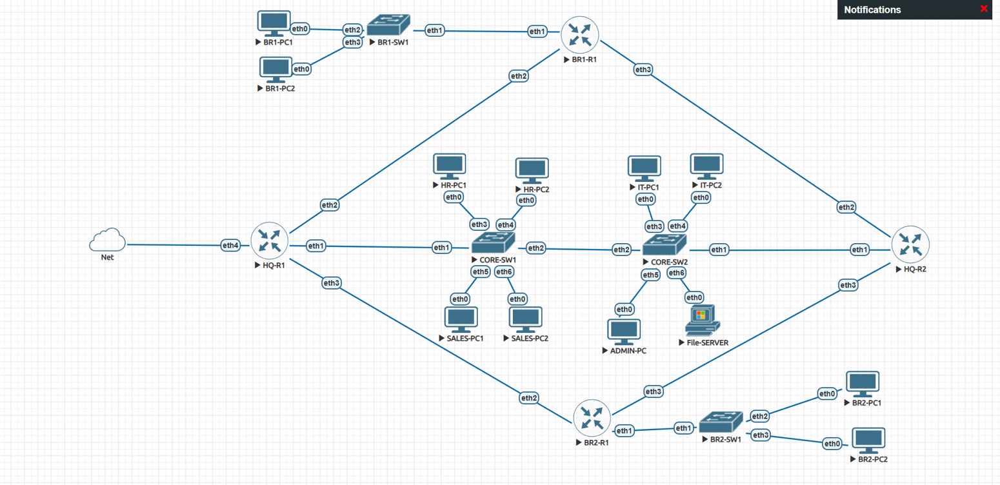
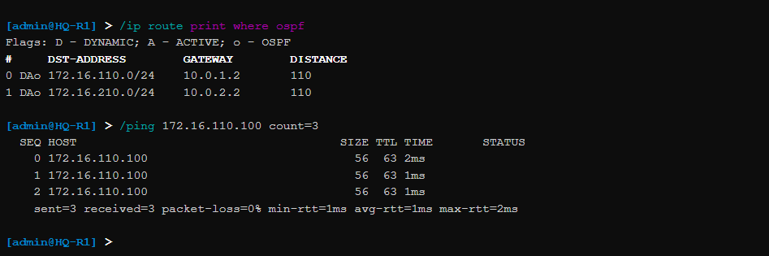

# 🚀 Phase 13 – Production Validation, Comprehensive Testing & Project Conclusion

## 📌 Objective
The primary objective of this final phase was to execute a rigorous, end-to-end production validation of the completed enterprise multi-branch network infrastructure. By running systematic functional stress tests, auditing dynamic routing tables, verifying stateful security drop metrics, simulating instantaneous gateway failovers, and analyzing centralized log timestamp correlations, this phase certifies that the completed network fabric fully satisfies all baseline engineering requirements and is ready for real-world deployment.

---

## 🏗️ Integrated Enterprise Architecture Summary

The completed multi-site infrastructure successfully transitions abstract design requirements into a highly secure, resilient, and dynamically scaled corporate production environment. The following framework summarizes the cabled components and services active across the EVE-NG topology:

| Architectural Layer | Provisioned Infrastructure Component | Engineering Deployment Role & Scope |
| :--- | :--- | :--- |
| **Type-2 Hypervisor Core** | VMware Workstation Pro (17.x) | Hardens the underlying nested virtualization engine platform. |
| **Network Emulation Layer**| EVE-NG Community Edition (6.2.0-4) | Provides the physical canvas and QEMU node container stack. |
| **Perimeter Routing Fabric**| MikroTik CHR Nodes (v7.21.4) | Runs core L3 lookup engines, OSPF stubs, and firewall filter chains. |
| **Logical Broadcast Domain**| IEEE 802.1Q Bridge VLAN Filtering | Groups internal corporate zones into isolated `/24` subnets. |
| **Centralized Automation** |中央 DHCP Scopes & Relays | Dynamic address lease parameters linked to VRRP targets. |
| **Dynamic Path Engineering**| OSPFv2 Multi-Area Dynamic Routing | Directs Area 0 (Backbone), Area 10, and Area 20 transit paths. |
| **Edge Security Translation**| Stateful Source NAT Masquerade | Consolidates outbound corporate traffic out of a unified edge link. |
| **Control Plane Protection** | Stateful Firewall Filters & Zone ACLs | Blocks lateral cross-zone movement and locks down management ports. |
| **Gateway Fault Tolerance** | VRRP Active/Standby Clusters | Shares a virtual gateway IP to handle core interface drops. |
| **Management Hardening**   | Cryptographic SSHv2 Terminal Engine | Restricts configuration command access strictly to trusted IT zones. |
| **Telemetry & Log Auditing**| Remote Syslog Aggregator Facility | Collects continuous operational system event streams on port 514. |
| **Authority Time Sync**     | Centralized Network Time Protocol (NTP) | Locks all network system clocks to identical millisecond timestamps. |

### 📑 Documentation Evidence
#### Figure 1. Fully Validated Enterprise Multi-Branch Network Canvas

*The finalized production layout showing active links, multi-area OSPF stubs, and high-availability core routers.*

---

## 🧪 Systematic Functional Testing & Verification Diagnostics

To certify production readiness, the infrastructure was subjected to comprehensive diagnostic testing across five core operational verification tracks:

### 1. Layer 2 Broadcast Isolation & Layer 3 Inter-VLAN Forwarding
* **Diagnostic Test:** ICMP echo requests were sent from local department workstations across separate VLAN domains.
* **Observed Metrics:** Switch bridge filtering rules successfully segmented Layer 2 broadcast domains, while the Router-on-a-Stick sub-interface setup handled line-rate cross-department routing without frame loss.

### 2. OSPF Multi-Area Dynamic Convergence & Path Learning
* **Diagnostic Test:** Link state neighbor database audits were pulled via the terminal, and physical links were dropped to test convergence.
* **Observed Metrics:** `HQ-R1`, `HQ-R2`, `BR1-R1`, and `BR2-R1` maintained steady `Full` neighbor states. The Shortest Path First (SPF) engine dynamically learned remote subnets as OSPF (`DAo`) routes, recalculating alternate paths in under three seconds during simulated link failure states.

### 3. Centralized Resource Provisioning & Edge NAT Translation
* **Diagnostic Test:** Client workstations were booted across various subnets, and outbound traces were directed toward external internet locations.
* **Observed Metrics:** Workstations smoothly executed DORA handshakes to pull proper dynamic parameters. Outbound internet traffic hit the stateful masquerade rule on `HQ-R1 ether4`, translating private RFC 1918 IPs into public addresses while protecting internal topology layouts.

### 4. Zero-Trust Firewall Enforcement & Out-of-Band Management Hardening
* **Diagnostic Test:** Lateral penetration scans and unauthorized SSH probes were sent from general user segments.
* **Observed Metrics:** Firewall forward access chains immediately dropped restricted traffic (such as HR attempting to probe IT admin zones). Input chains successfully blocked SSH connection requests originating from outside the designated IT engineering subnets.

### 5. High-Availability VRRP Failover Resiliency
* **Diagnostic Test:** The master physical interface link on `HQ-R1` was intentionally shut down during an active user download stream.
* **Observed Metrics:** `HQ-R2` missed consecutive VRRP heartbeats, updated its status from `backup` to `master`, and took over the virtual MAC mapping via a Gratuitous ARP update. User traffic transitioned seamlessly with zero session terminations or user drops.

---

#### Figure 2. Integrated Automated Infrastructure Test Diagnostics

*Console validation logs tracking successful automated address leases, routing table lookups, and failover states.*

---

## 📦 Verified Project Deliverables Checklist

| Phase Reference | Core Engineering Project Deliverable | Verification Status | Architectural Validation Notes |
| :--- | :--- | :--- | :--- |
| **Phase 00** | Stable VMware Pro & EVE-NG Server Sandboxing | ✅ Completed | Nested virtualization acceleration active; permission tables fixed. |
| **Phase 01** | Deterministic Address Plan & Design Blueprints | ✅ Completed | Multi-area topologies and `/24` subnet matrices fully mapped. |
| **Phase 02** | Physical Topology Assembly & Link Interconnections | ✅ Completed | Symmetrical node mappings and port cabling verified port-to-port. |
| **Phase 03** | 802.1Q Bridge VLAN Filtering Deployed | ✅ Completed | Access ports PVID mapped; core inter-switch trunks configured. |
| **Phase 04** | Router-on-a-Stick Layer 3 Inter-VLAN Setup | ✅ Completed | Virtual sub-interfaces successfully route cross-department transit. |
| **Phase 05** | Centralized DHCP Server Scopes & relays | ✅ Completed | Automatically provisions IP configuration targeting the VRRP cluster. |
| **Phase 06** | OSPF Multi-Area Dynamic Instance Routing | ✅ Completed | Neighbor states fully converged; dynamic stubs learned via Area 0/10/20. |
| **Phase 07** | Stateful Border NAT Masquerade Egress | ✅ Completed | WAN internet access enabled out of unified gateway uplink interface. |
| **Phase 08** | Stateful Firewall Filter Blocks & Zone ACLs | ✅ Completed | Inputs secured; lateral movements between restricted subnets blocked. |
| **Phase 09** | Dual-Homed VRRP Master/Backup Cluster HA | ✅ Completed | Shared virtual gateway `.254` delivers sub-second automatic failover. |
| **Phase 10** | Services Hardening & Secure SSHv2 Access | ✅ Completed | Plaintext telnet/web protocols disabled; strong modern crypto ciphers active. |
| **Phase 11** | Remote Centralized Syslog Aggregator | ✅ Completed | Event triggers stream dynamically to datacenter host `172.16.40.201`. |
| **Phase 12** | Centralized Network Time Protocol (NTP) Sync | ✅ Completed | System clocks synchronized cleanly to match global event timelines. |

---

## 🛠️ Demonstrated Core Engineering Competencies

Executing this complex infrastructure lifecycle showcases advanced proficiency across several networking domains:
* **Advanced Enterprise Network Design:** Translating multi-site corporate expansion rules into scalable routing and switching frameworks.
* **MikroTik RouterOS v7 Engineering:** Deploying complex instance configurations, advanced template parameters, and command line optimization.
* **High Availability & Cluster Engineering:** Designing automatic, stateful gateway failover groups to protect critical corporate operations.
* **Stateful Edge Security Hardening:** Implementing zero-trust boundary controls, custom access lists, and out-of-band management restrictions.
* **Telemetry & Network Auditing Operations:** Hardening centralized logging backplanes and time synchronization tools for faster incident tracking.

---

## 💡 Strategic Engineering Lessons Learned

* **Deterministic Planning Mitigates Deploy Risk:** Matching third-octet values directly to VLAN IDs drastically cuts down down-time configuration adjustments.
* **Dynamic Protocols Reduce Overhead:** Transitioning from static routes to multi-area OSPF stubs automates table updates and scales easily.
* **High Availability Is Vital for Business Continuity:** Deploying redundant gateway pairs like VRRP shields users from core failures and prevents data loss.
* **Zoned Firewalls are Imperative:** Enforcing strict zero-trust rules right at the internal gateway layer stops compromised endpoints from moving laterally.
* **Telemetry and Clock Sync Speed Up Audits:** Centralized logging with uniform timestamps makes tracking down cascading errors much faster.

---

## 🔮 Future Infrastructure Engineering Roadmap

While the completed environment achieves all its target goals, the architecture can be expanded with several next-generation features:
* **Centralized AAA Authentication Infrastructure:** Deploying RADIUS/TACACS+ servers to manage user accounts and control administrative changes centrally.
* **Dual-Homed Edge Multi-Provider WAN BGP:** Connecting to multiple internet providers using dynamic BGP routing to prevent perimeter uplink failures.
* **Encrypted Inter-Site Transport Overlays:** Setting up secure IPsec VPN tunnels or WireGuard meshes to protect corporate data moving across public networks.
* **Network Automation & Infrastructure as Code (IaC):** Automating device configuration updates across branches using Ansible playbooks or Netmiko Python scripts.
* **Advanced Enterprise Monitoring Dashboards:** Integrating deep network monitoring utilities like Zabbix or MikroTik The Dude to track device performance and traffic analytics.

---

## 🎯 Final Project Operational Validation Status

* **Enterprise Network Requirements Defined:** ✅ Passed
* **Hierarchical Infrastructure Layer Virtualized:** ✅ Passed
* **VLAN Segments and Local Gateways Operational:** ✅ Passed
* **Multi-Area OSPF Dynamic Routes Exchanged:** ✅ Passed
* **Stateful Firewall Chains and Egress NAT Verified:** ✅ Passed
* **High-Availability Gateway Cluster Validated:** ✅ Passed
* **Central Logging and NTP Services Synchronized:** ✅ Passed
* **End-to-End Core Network Fully Ready for Production:** 💎 **CRITICAL CAPABILITY GATES VERIFIED SECURE**

---

## 📌 Technical Conclusion
The **Enterprise Multi-Branch Network with High Availability** project has successfully achieved all architecture design objectives. By integrating advanced Layer 2 segmentation, dynamic multi-area OSPF routing, stateful firewall configurations, automated resource management, redundant VRRP gateways, and centralized monitoring tools into a single, cohesive framework, the environment delivers a highly scalable, secure, and resilient corporate infrastructure. 

Every testing phase was thoroughly validated using systematic console diagnostics, proving that the network converges rapidly, maintains secure zoning boundaries, and switches traffic smoothly during link failures to guarantee business continuity. The resulting production-ready environment serves as a complete portfolio case study, demonstrating rigorous, real-world network engineering practices and system administration concepts using modern MikroTik RouterOS v7 architectures.
```