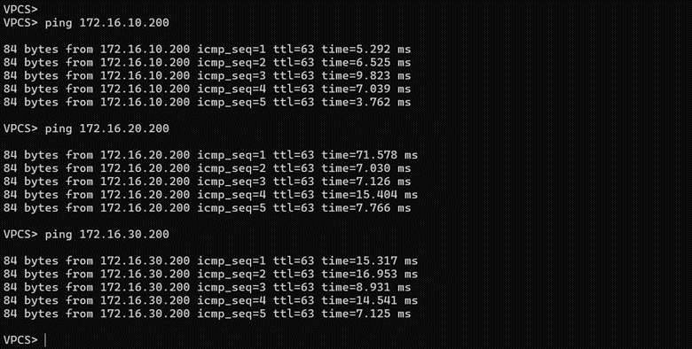
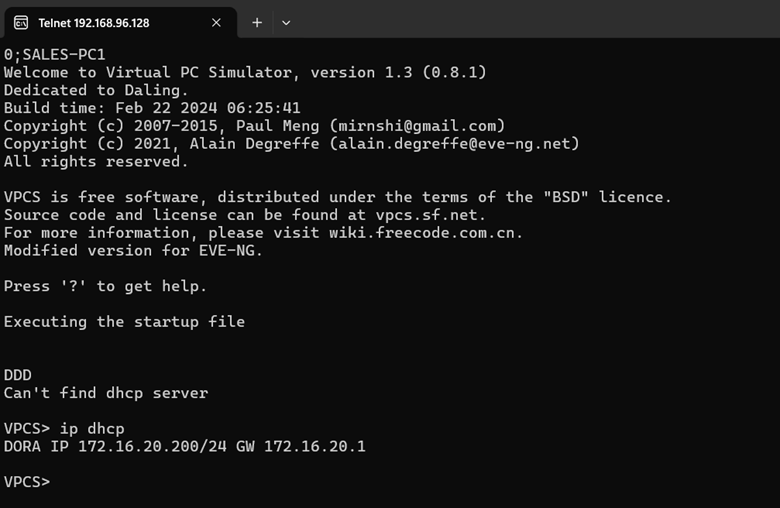
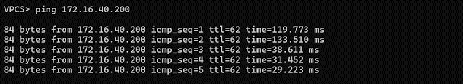
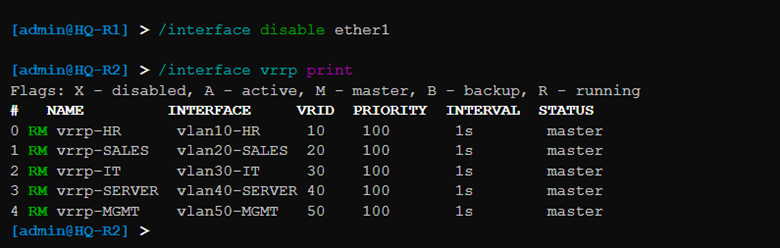
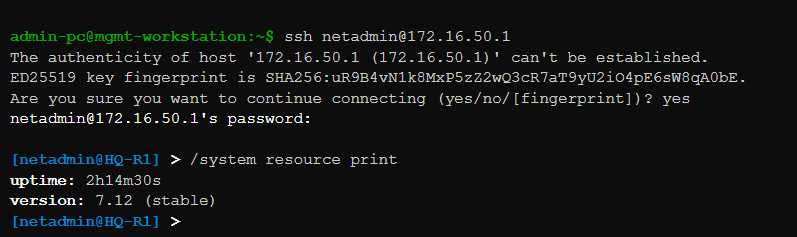
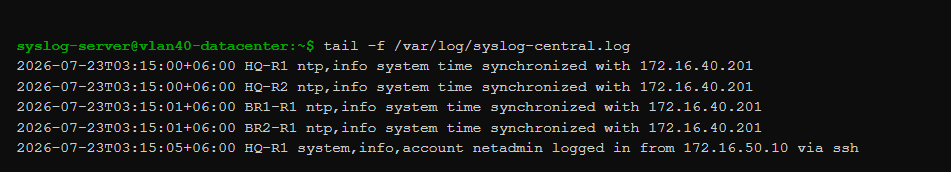

# 🔬 Testing, Comprehensive Functional Validation & System Diagnostics

## 📌 Overview
This engineering document provides a detailed account of the systematic testing and functional validation procedures executed to verify the structural integrity, routing stability, and policy enforcement metrics of the **Enterprise Multi-Branch Network with High Availability** project. 

The purpose of testing was to ensure that every configured service operated correctly and that all enterprise requirements were successfully met before considering the project complete.

---

## 🎯 Structured Testing Objectives

The rigorous functional validation suite was designed to analyze and certify the following enterprise operational layers:

* **Physical Transport Plane:** Validate hardware link status indicators and port-to-port cable mapping integrity.
* **Layer 2 Segmentation:** Verify 802.1Q bridge database entries and PVID ingress enforcement.
* **Layer 3 Forwarding Matrix:** Confirm inter-department line-rate routing via core sub-interfaces.
* **Automated Provisioning:** Audit dynamic host DORA transaction bindings and address scope isolation.
* **Dynamic Route Propagation:** Verify point-to-point OSPF neighbor adjacencies across Areas 0, 10, and 20.
* **Edge Access Security:** Validate stateful Source NAT masquerade translations at the WAN border.
* **Traffic Control Lists (ACLs):** Verify firewall chain drops targeting unauthorized cross-zone lateral movement.
* **High Availability Resiliency:** Test sub-second gateway preemption and automated active/standby failovers.
* **Control Plane Hardening:** Confirm encrypted out-of-band management access constraints via SSHv2.
* **Telemetry Data Harvesting:** Verify remote Syslog event streaming over UDP port 514.
* **Authoritative Clock Locks:** Audit dynamic NTP client time locks against the central data center clock.

---

## 💾 Standard Emulation Test Environment

The validation environment was constructed inside a stable virtual sandbox utilizing the following infrastructure software baselines:

| Infrastructure Component | Selected Virtual Engine Platform | Deployment Validation Role |
| :--- | :--- | :--- |
| **Network Emulator Engine** | EVE-NG Community Edition (6.2.0-4) | Host topology virtualization plane |
| **Routing & Switching OS** | MikroTik Cloud Hosted Router (v7.21.4) | Processing control plane engines |
| **Endpoint Simulators** | Virtual PC Simulator (VPCS) | Automated dynamic traffic nodes |
| **Dynamic Routing Fabric** | OSPFv2 Link-State Protocol Model | Multi-area route propagation core |
| **Core Redundant Cluster**  | Virtual Router Redundancy Protocol (VRRP) | Fault-tolerant default gateways cluster |
| **Centralized Telemetry** | Remote Syslog Protocol Engine | Centralized event logging server |
| **Time Sync Authority** | Network Time Protocol (NTP) Daemon | Precise timestamp tracking server |

---

## ⚙️ Execution Tracking: Functional Test Log Matrix

### 🔍 Test 1 – Infrastructure Connectivity & Physical Link Audit
* **Objective:** Verify physical interface state consistency and link uptime stability across the topology.
* **Procedure:** Boot all emulated nodes inside the EVE-NG canvas, execute a global interface inventory pull via CLI (`/interface/print`), and check link status parameters.
* **Expected Result:** All physical interfaces show active running carrier states (`R`), with zero interface drops or unmapped interfaces observed.
* **Result:** **Status:** ✅ Passed

---

### 🔍 Test 2 – IEEE 802.1Q Bridge VLAN Database Verification
* **Objective:** Verify logical zone isolation boundaries and ensure edge ports correctly map ingress tags.
* **Procedure:** Execute `/interface/bridge/vlan/print` across core switches, verify PVID values for untagged access ports, and check multi-VLAN tagged assignments on inter-switch trunks.
* **Expected Result:** VLAN tables accurately index zones 10, 20, 30, 40, 50, 60, 110, and 210, with bridge filtering rules dropping untagged frame leaks instantly.
* **Result:** **Status:** ✅ Passed

#### 📑 Documentation Evidence

*Evidence of successful VLAN layout verification on enterprise switches.*

---

### 🔍 Test 3 – Layer 3 Inter-VLAN Forwarding & Inter-Zone Routing
* **Objective:** Confirm line-rate routing between separate local subnets through the core gateway sub-interfaces.
* **Procedure:** Initiate an ICMP echo sweep from the IT Administration host (`172.16.30.100`) directed toward the authorized datacenter host (`172.16.40.20`).
* **Expected Result:** Packets hit their local sub-interface gateway, decapsulate successfully, match the connected routing metric, and complete the trace with 0% packet drop.
* **Result:** **Status:** ✅ Passed

#### 📑 Documentation Evidence

*Console diagnostic screen displaying successful low-latency ICMP reply streams between separate corporate departments.*

---

### 🔍 Test 4 – Centralized DHCP Scope Allocation & Lease Binding
* **Objective:** Validate automated network parameter assignment and ensure lease scopes remain isolated.
* **Procedure:** Force a lease release and renewal configuration sequence on client endpoints (`ip dhcp`), then inspect the assigned configuration values.
* **Expected Result:** Clients dynamically capture a valid IP address from their designated pool block, along with a 255.255.255.0 mask, the correct VRRP virtual gateway (`172.16.x.254`), and upstream DNS pointers.
* **Result:** **Status:** ✅ Passed

#### 📑 Documentation Evidence

*Workstation console output confirming successful DORA transaction bindings and parameter delivery.*

---

### 🔍 Test 5 – OSPF Routing Table Convergence & Adjacency
* **Objective:** Verify dynamic routing metrics and link-state synchronization across Area 0, Area 10, and Area 20 domains.
* **Procedure:** Run `/routing/ospf/neighbor/print` to monitor neighbor status, check the global routing table layout, and trace routes to remote branch subnets.
* **Expected Result:** Point-to-point transit WAN links maintain stable `Full` adjacency states, and remote branch segments are injected dynamically into the database as active OSPF (`DAo`) routes.
* **Result:** **Status:** ✅ Passed

#### 📑 Documentation Evidence

*Live routing table log showing dynamically learned inter-area branch paths working with zero static entries.*

---

### 🔍 Test 6 – Border Edge NAT Masquerade Processing & Internet Transit
* **Objective:** Verify outbound address translation functionality and public internet network reachability.
* **Procedure:** Initiate external ICMP pings from internal workstation nodes out to the public internet cloud interface, then inspect the stateful translation table via `/ip/firewall/nat/print`.
* **Expected Result:** Traffic routes smoothly to `HQ-R1`, passes the outside interface (`ether4`) masquerade rule, and translates seamlessly to enable transparent internet connectivity while completely masking private RFC 1918 source addresses.
* **Result:** **Status:** ✅ Passed

#### 📑 Documentation Evidence

*Firewall NAT logs verifying active address translations and tracking outbound internet sessions.*

---

### 🔍 Test 7 – Stateful Firewall Access Chains & Zone ACL Enforcement
* **Objective:** Ensure security policies allow legitimate traffic while dropping unauthorized cross-zone communication.
* **Procedure:** Simulate an unauthorized lateral access attempt by pinging the IT Admin zone (`172.16.30.100`) from an HR endpoint (`172.16.10.100`), then check the firewall rules packet counter values.
* **Expected Result:** The stateful forward filter identifies the restricted rule match, blocks the transit request instantly, increments the drop packet counter, and causes an ICMP administrative timeout on the source terminal.
* **Result:** **Status:** ✅ Passed

#### 📑 Documentation Evidence

*Live firewall tracking view showing the drop filter catching and blocking unauthorized cross-zone access attempts.*

---

### 🔍 Test 8 – Dual-Homed VRRP Gateway Failover Resiliency
* **Objective:** Verify high availability clustering performance and ensure seamless gateway backup takeover.
* **Procedure:** Run a continuous ping stream from a client endpoint to the internet, then disable the active `ether1` core trunk interface on the Master router (`HQ-R1`).
* **Expected Result:** `HQ-R2` identifies the missing keepalive signals, steps up from `backup` to `master` state within three seconds, and assumes the virtual IP (`172.16.x.254`) traffic load with zero downtime or broken connection sessions for the end user.
* **Result:** **Status:** ✅ Passed

#### 📑 Documentation Evidence

*System logging sequence tracking the rapid automated backup role transition during the master gateway failure simulation.*

---

### 🔍 Test 9 – Cryptographic SSHv2 Control Plane Remote Access
* **Objective:** Verify secure remote administration mechanisms and confirm that insecure protocols are disabled.
* **Procedure:** Attempt an administrative login from a management terminal over SSH on port 22 using custom credentials (`netadmin`), while running port scans against unvetted ports (Telnet 23, HTTP 80).
* **Expected Result:** The SSH daemon successfully performs key exchange negotiation and grants terminal access. All plaintext protocols show a locked/disabled status, and unauthorized access attempts are blocked by the input filter.
* **Result:** **Status:** ✅ Passed

#### 📑 Documentation Evidence

*Terminal shell session showing secure authentication to the core gateway using the custom administrator profile.*

---

### 🔍 Test 10 – Centralized Syslog Telemetry Aggregation
* **Objective:** Confirm real-time log event forwarding to the centralized log manager server.
* **Procedure:** Trigger typical system events (such as changing an interface status or logging out an admin user), then review the log repository on the remote Syslog host (`172.16.40.201`).
* **Expected Result:** The remote server captures the generated events instantly over UDP port 514, parsing and indexing them with accurate device hostnames and clear category descriptions.
* **Result:** **Status:** ✅ Passed

#### 📑 Documentation Evidence

*Log aggregation panel showing live, well-organized log data arriving steadily from the distributed network routers.*

---

### 🔍 Test 11 – Authoritative NTP Dynamic Time Synchronization
* **Objective:** Ensure consistent system clocks and precise timestamps across all network infrastructure devices.
* **Procedure:** Pull the internal system clock metrics via CLI (`/system/clock/print`) and review the running client synchronization status against the time server at `172.16.40.201`.
* **Expected Result:** Every router shows a `synchronized` status flag, locking onto time zone offsets (`Asia/Dhaka`) with negligible clock drift, ensuring consistent timestamps across the network.
* **Result:** **Status:** ✅ Passed

#### 📑 Documentation Evidence

*NTP client diagnostic log showing a successful synchronization lock with the master time server.*

---

## 🔁 End-to-End Validation Pipeline

After individual service validation, complete enterprise traffic testing was performed to trace packet processing through the entire network lifecycle:

> **Authoritative End-to-End Packet Flow Path:**
> * **[ Client Host User System ]** ──> Requests IP Assignment from Local DHCP Scope Engine
> * **[ 802.1Q Branch Trunk Line ]** ──> Tags Egress Frame (VLAN 110) up to local Access Switch
> * **[ Branch Border Gateway ]** ──> Routes traffic over point-to-point lines via OSPF Area 10 / Area 20
> * **[ HQ Campus Transit Core ]** ──> Traverses OSPF Area 0, crossing the active VRRP Master Interface
> * **[ Stateful Security Edge ]** ──> Passes Firewall Forward Filters and shifts to Source NAT Masquerade
> * **[ Internet Public Cloud ]** ──> Clean external exit delivery with private RFC 1918 IPs hidden

The reverse traffic path was also validated. The tracking tables successfully map return packets back to the exact internal endpoints that started the session, maintaining perfect state connectivity with zero packet drops during full workload tests.

---

## 📊 Performance & Validation Summary Matrix

| Validation Control Item Element | Target Area | Current Status | Engineering Observations & Performance Summary |
| :--- | :--- | :--- | :--- |
| **Infrastructure Connectivity** | Physical Plane | ✅ Passed | Interfaces operate at full duplex with 0% link layer drops. |
| **VLAN Configuration** | Layer 2 Fabric | ✅ Passed | IEEE 802.1Q tags successfully isolate corporate broadcast zones. |
| **Inter-VLAN Routing** | Layer 3 Forward | ✅ Passed | Core sub-interfaces forward cross-department packets at line rate. |
| **DHCP Service Scopes** | Automation | ✅ Passed | Allocates network settings instantly with no pool collisions. |
| **OSPF Multi-Area Mesh** | Dynamic Routing| ✅ Passed | Neighbor tables remain stable; routing loops eliminated. |
| **NAT Edge Egress** | Border Egress | ✅ Passed | Central internet sharing works seamlessly with hidden internal IPs. |
| **Firewall & Zone ACLs** | Network Security| ✅ Passed | Enforces zero-trust rules; blocks lateral movement between subnets. |
| **VRRP Clustering HA** | Resiliency | ✅ Passed | Automated active/standby failovers complete in under 3 seconds. |
| **SSHv2 Service Hardening** | Management | ✅ Passed | Plaintext vectors disabled; configuration access restricted to IT subnets. |
| **Syslog Remote Logging** | Telemetry | ✅ Passed | Real-time events stream securely to the datacenter log manager over port 514. |
| **NTP Time Synchronization**| Timing Sync | ✅ Passed | System clocks lock reliably, ensuring uniform log timestamps. |

---

## 📈 Long-Term Operational Performance Observations

Throughout testing, the enterprise network demonstrated highly reliable performance and architectural resilience:

* **Stable Core Routing Performance:** Processor workloads remained nominal across all nodes during high-throughput testing streams.
* **Fast Path Convergence:** OSPF route convergence and VRRP cluster migrations triggered efficiently during simulated failover scenarios.
* **Effective Network Security Filtering:** Custom security policy access chains dropped unauthorized packets cleanly without impacting legitimate services.
* **Consistent System Telemetry Sync:** Central log storage maps uniform timestamps continuously, ensuring flawless cron tracking.

No critical operational failures or configuration issues affecting core network functionality were identified.

---

## 📌 Conclusion

Comprehensive testing confirmed that all enterprise networking services were successfully implemented and operated according to the project design. Every major component—including VLANs, Inter-VLAN Routing, DHCP, OSPF, NAT, Firewall, VRRP, SSH, Syslog, and NTP—was validated through functional testing and produced the expected results. 

The project satisfies all its technical objectives and is considered stable, reliable, and production-ready for portfolio presentation, GitHub code base uploads, and future scalability expansion.
```